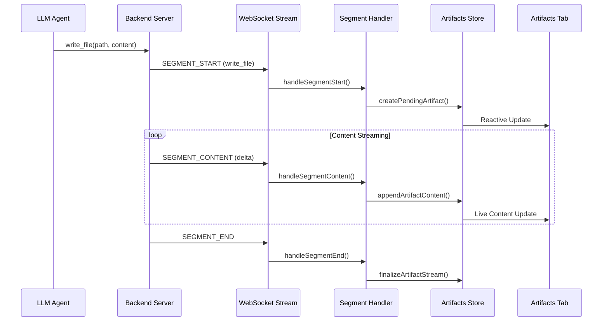

# Agent Artifacts

## Overview

Agent Artifacts are files generated by agents during execution. When an agent uses the `write_file` tool, the content is streamed in real-time to the frontend and presented as an artifact—a file that is being authored by the agent. This provides immediate visual feedback to users as agents write code or create files.



---

## Architecture

### Artifact Lifecycle

Artifacts progress through four status states:

| Status             | Description                                                    |
| ------------------ | -------------------------------------------------------------- |
| `streaming`        | Content is actively being streamed from the agent.             |
| `pending_approval` | Stream complete; awaiting user approval of the tool execution. |
| `persisted`        | Tool approved; file successfully written to disk.              |
| `failed`           | Tool rejected or execution failed.                             |

### Data Model

```typescript
interface AgentArtifact {
  id: string; // Unique identifier
  agentId: string; // Owning agent
  path: string; // Relative file path (e.g., "src/hello.py")
  type: "file" | "image" | "video" | "pdf" | "other";
  status: ArtifactStatus;
  content?: string; // Text content buffer
  url?: string; // Media URL (for non-text types)
  createdAt: string; // ISO timestamp
}
```

---

## Implementation

### Key Components

| Component            | Path                                                                                                                                       | Description                                                       |
| -------------------- | ------------------------------------------------------------------------------------------------------------------------------------------ | ----------------------------------------------------------------- |
| **Store**            | [agentArtifactsStore.ts](file:///home/ryan-ai/SSD/autobyteus_org_workspace/autobyteus-web/stores/agentArtifactsStore.ts)                   | Pinia store managing artifact state per agent.                    |
| **Segment Handler**  | [segmentHandler.ts](file:///home/ryan-ai/SSD/autobyteus_org_workspace/autobyteus-web/services/agentStreaming/handlers/segmentHandler.ts)   | Hooks into streaming events to trigger artifact creation/updates. |
| **Artifact Handler** | [artifactHandler.ts](file:///home/ryan-ai/SSD/autobyteus_org_workspace/autobyteus-web/services/agentStreaming/handlers/artifactHandler.ts) | Handles backend persistence confirmation events.                  |
| **UI Component**     | [ArtifactsTab.vue](file:///home/ryan-ai/SSD/autobyteus_org_workspace/autobyteus-web/components/workspace/agent/ArtifactsTab.vue)           | Displays artifact list and content viewer.                        |
| **GraphQL Query**    | [agentArtifactQueries.ts](file:///home/ryan-ai/SSD/autobyteus_org_workspace/autobyteus-web/graphql/queries/agentArtifactQueries.ts)        | Query for fetching persisted artifacts from backend.              |

---

### Store Actions

The `agentArtifactsStore` provides the following actions:

| Action                     | Trigger                      | Description                                                                                                                        |
| -------------------------- | ---------------------------- | ---------------------------------------------------------------------------------------------------------------------------------- |
| `createPendingArtifact()`  | `SEGMENT_START` (write_file) | Creates a new artifact in `streaming` status. If an artifact with the same path exists, resets it instead of creating a duplicate. |
| `appendArtifactContent()`  | `SEGMENT_CONTENT`            | Appends streamed content delta to the active artifact.                                                                             |
| `finalizeArtifactStream()` | `SEGMENT_END`                | Transitions artifact to `pending_approval` status.                                                                                 |
| `markArtifactPersisted()`  | Backend event                | Updates status to `persisted` after tool execution.                                                                                |
| `markArtifactFailed()`     | Backend event                | Updates status to `failed` if tool rejected/errored.                                                                               |
| `fetchArtifactsForAgent()` | Session restore              | Loads persisted artifacts from backend (future feature).                                                                           |

---

### Streaming Integration

The segment handler (`segmentHandler.ts`) integrates artifacts with the streaming pipeline:

```typescript
// On SEGMENT_START for write_file
if (payload.segment_type === "write_file" && payload.metadata?.path) {
  const store = useAgentArtifactsStore();
  store.createPendingArtifact(
    context.state.agentId,
    payload.metadata.path,
    "file"
  );
}

// On SEGMENT_CONTENT for write_file
if (segment.type === "write_file") {
  const store = useAgentArtifactsStore();
  store.appendArtifactContent(context.state.agentId, payload.delta);
}

// On SEGMENT_END for write_file
if (segment.type === "write_file") {
  const store = useAgentArtifactsStore();
  store.finalizeArtifactStream(context.state.agentId);
}
```

---

## UI Components

### Artifacts Tab

Located in the right sidebar, the `ArtifactsTab` component provides:

1. **Artifact List View**: Shows all artifacts for the current agent with status indicators.
2. **Detail View**: Displays file content using Monaco Editor (read-only during streaming/pending).
3. **Auto-Selection**: Automatically focuses on actively streaming artifacts.

#### Status Icons

| Status             | Icon               | Color  |
| ------------------ | ------------------ | ------ |
| `streaming`        | Spinning ring      | Blue   |
| `pending_approval` | Raised hand        | Yellow |
| `persisted`        | Check circle       | Green  |
| `failed`           | Exclamation circle | Red    |

### Integration with Write File Segment

The `WriteFileCommandSegment` component includes a button to open the Artifacts Tab directly, providing contextual navigation from the conversation to the artifact viewer.

---

## Testing

Unit tests are colocated with the store:

**Path**: [agentArtifactsStore.spec.ts](file:///home/ryan-ai/SSD/autobyteus_org_workspace/autobyteus-web/stores/__tests__/agentArtifactsStore.spec.ts)

**Run tests**:

```bash
yarn test:nuxt stores/__tests__/agentArtifactsStore.spec.ts --run
```

**Test Coverage**:

- Creating pending artifacts
- Appending streamed content
- Finalizing artifact streams
- Marking artifacts as persisted
- Updating existing artifact when same path is used (no duplicates)

---

## Related Documentation

- [Agent Execution Architecture](./agent_execution_architecture.md): The streaming architecture that powers artifact creation.
- [Content Rendering](./content_rendering.md): How artifact content is displayed in the Monaco Editor.
- [Tools & MCP](./tools_and_mcp.md): The `write_file` tool that generates artifacts.
