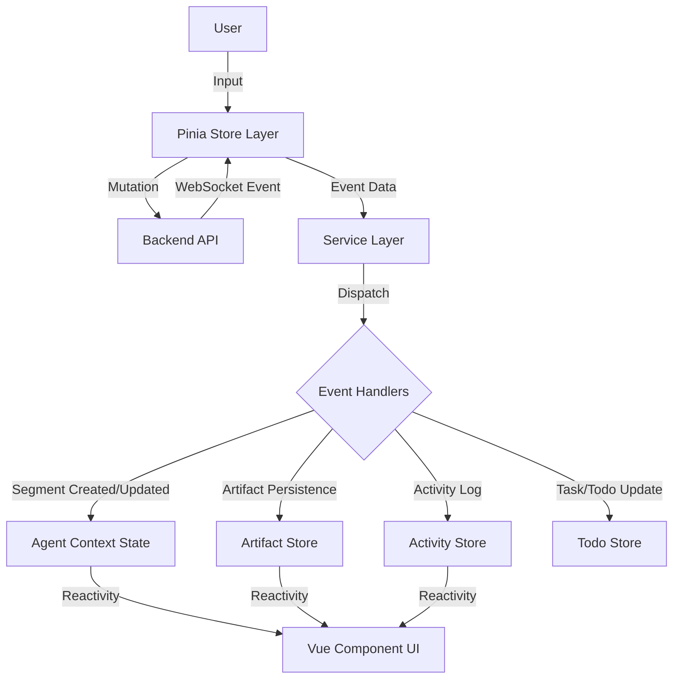

# Agent Execution Architecture

## Overview

This document outlines the end-to-end architecture of how Agent and Agent Team executions are managed in the frontend. The architecture has evolved to offload complex parsing to the backend. The frontend now acts as a **Renderer** of structured events rather than a parser of raw text.

The data flow follows a top-down approach:

1.  **Orchestration Layer (Stores)**: Manages lifecycle, user input, and WebSocket streaming connections.
2.  **Service Layer (Event Routing)**: Dispatches incoming structured WebSocket events to specific handlers.
3.  **Segment Processing (Handlers)**: Updates the reactive `AgentContext` and sidecar stores based on event payloads.

---

## Level 1: Orchestration Layer (Stores)

The Pinia stores act as the primary interface for the UI components to interact with the agent backend. They are responsible for initiating actions (Mutations) and listening for updates (WebSocket streams).

### `agentRunStore.ts` (Single Agents)

- **Role**: Manages the execution lifecycle of individual agents.
- **Key Actions**:
  - `sendUserInputAndSubscribe()`: Sends user messages via mutation and ensures an agent WebSocket stream is connected.
  - `connectToAgentStream(agentId)`: Listens for real-time events specific to an agent run via WebSocket.
  - `postToolExecutionApproval()`: Sends user decisions (Approve/Deny) for "Awaiting Approval" tool calls.
  - `closeAgent()`: Cleans up local state and unsubscribes.

### `agentTeamRunStore.ts` (Agent Teams)

- **Role**: Manages multi-agent team sessions.
- **Key Actions**:
  - `createAndLaunchTeam()`: Orchestrates the creation of a new team run configuration and starts the session.
  - `launchExistingTeam()`: Resumes or starts a session from an existing team instance.
  - `connectToTeamStream(teamId)`: Listens for team-level events (e.g., task updates, status changes) via WebSocket.
  - `sendMessageToFocusedMember()`: Routes user input to a specific agent within the team context.

---

## Level 2: Service Layer (Event Routing)

The service layer bridges the gap between the WebSocket transport and the application's business logic. It essentially functions as a router.

### `AgentStreamingService.ts`

- **Role**: WebSocket facade for single-agent streams.
- **Responsibilities**:
  1.  Maintains the WebSocket connection (`transport/WebSocketClient`).
  2.  Parses raw JSON messages into typed `ServerMessage` objects (`protocol/messageTypes`).
  3.  Dispatches messages to the appropriate pure-function handler.

### Dispatch Logic

Incoming events are routed based on their `type`:

| Event Type                | Handler Function                                   | Purpose                                                         |
| :------------------------ | :------------------------------------------------- | :-------------------------------------------------------------- |
| `SEGMENT_START`           | `segmentHandler.handleSegmentStart`                | Creates a new UI segment (Text, Code, Tool).                    |
| `SEGMENT_CONTENT`         | `segmentHandler.handleSegmentContent`              | Appends streaming content (deltas) to an existing segment.      |
| `SEGMENT_END`             | `segmentHandler.handleSegmentEnd`                  | Finalizes a segment, setting final status or metadata.          |
| `TOOL_APPROVAL_REQUESTED` | `toolLifecycleHandler.handleToolApprovalRequested` | Sets segment status to `awaiting-approval`.                     |
| `TOOL_APPROVED`           | `toolLifecycleHandler.handleToolApproved`          | Marks invocation as approved before execution starts.           |
| `TOOL_DENIED`             | `toolLifecycleHandler.handleToolDenied`            | Marks invocation as terminal denied immediately.                |
| `TOOL_EXECUTION_STARTED`  | `toolLifecycleHandler.handleToolExecutionStarted`  | Sets segment status to `executing`.                            |
| `TOOL_EXECUTION_SUCCEEDED`| `toolLifecycleHandler.handleToolExecutionSucceeded`| Sets terminal `success` + stores result payload.               |
| `TOOL_EXECUTION_FAILED`   | `toolLifecycleHandler.handleToolExecutionFailed`   | Sets terminal `error` + stores failure details.                |
| `TOOL_LOG`                | `toolLifecycleHandler.handleToolLog`               | Appends diagnostic execution logs only.                         |
| `ARTIFACT_PERSISTED`      | `artifactHandler.handleArtifactPersisted`          | Updates the `AgentArtifactsStore` with a saved file.            |
| `TODO_LIST_UPDATE`        | `todoHandler.handleTodoListUpdate`                 | Syncs the agent's internal todo list with the UI.               |

---

## Level 3: Segment Processing & State Management

Unlike the previous architecture, the frontend **does not** parse raw text/XML tags. The backend is responsible for all parsing and sends "Segments" as its primary unit of communication.

### Segment Handlers (`services/agentStreaming/handlers`)

These handlers are pure functions that take a payload and an `AgentContext`, and mutate the context.

#### `segmentHandler.ts`

- **`handleSegmentStart`**: Finds the current AI message (or creates one) and pushes a new Segment object (e.g., `ToolCallSegment`, `WriteFileSegment`). It also initializes "Sidecar" entries (see below) for things like live file artifacts.
- **`handleSegmentContent`**: Finds the segment by ID and appends string deltas. This powers the "typewriter" effect.
- **`handleSegmentEnd`**: Performs cleanup, sets the final tool name if it was streamed lazily, and marks the segment as "parsed" (ready for execution state changes).

#### `toolLifecycleHandler.ts`

- Routes explicit lifecycle events through dedicated parse/state modules.
- Enforces monotonic non-terminal transitions: `awaiting-approval` -> `approved` -> `executing`.
- Enforces terminal precedence: `success` / `error` / `denied` are terminal and cannot be regressed by later non-terminal events or logs.
- Hydrates arguments only from lifecycle payloads (`TOOL_APPROVAL_REQUESTED`, `TOOL_EXECUTION_STARTED`).

### Sidecar Store Pattern

A key architectural pattern is the **Sidecar Store Pattern** for runtime data. Instead of keeping all state in a monolithic `AgentContext` (which is optimized for Chat UI), distinct data streams are routed to dedicated stores:

1.  **Artifacts (`AgentArtifactsStore`)**:
    - Listens to `write_file` segment events.
    - Builds a real-time, read-only preview of files being written _before_ they are saved to disk.
    - When `ARTIFACT_PERSISTED` arrives, it marks the file as saved.
2.  **Activity (`AgentActivityStore`)**:
    - Tracks every tool call, file write, and terminal command as a linear history of "Activities".
    - Used for the "Activity Feed" UI in the backend/sidebar.
3.  **Todos (`AgentTodoStore`)**:
    - Maintains the agent's Todo list separately from the chat history.

---

## Error Event Nuance (Tool vs System)

The backend can emit:

- Explicit tool terminal lifecycle events (`TOOL_EXECUTION_FAILED`, `TOOL_DENIED`) for invocation-scoped failures.
- A generic `ERROR` event for unrecoverable system/agent failures.

`TOOL_LOG` is diagnostic-only and never the lifecycle authority for completion/failure.

## Related Documentation

- **[Agent Management](./agent_management.md)**: Defines the agents whose execution is described here.
- **[Agent Teams](./agent_teams.md)**: Describes the orchestration of multiple agents.
- **[Content Rendering](./content_rendering.md)**: Details how the parsed segments (Markdown, Mermaid, etc.) are visualized.
