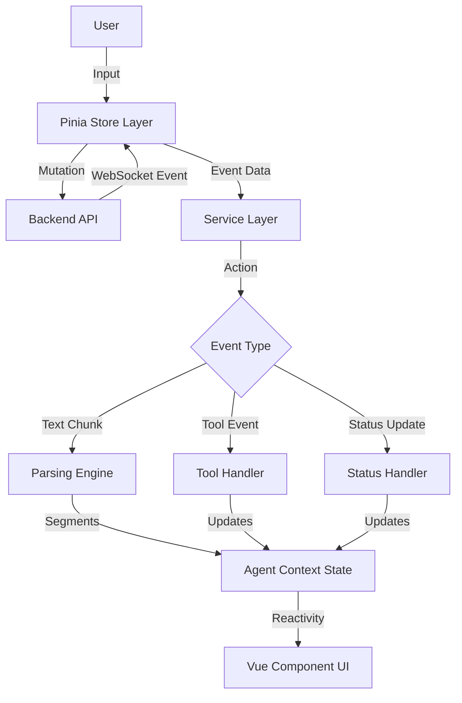

# Agent Execution Architecture

## Overview

This document outlines the end-to-end architecture of how Agent and Agent Team executions are managed in the frontend. The data flow follows a top-down approach:

1.  **Orchestration Layer (Stores)**: Manages lifecycle, user input, and WebSocket streaming connections.
2.  **Service Layer (Event Routing)**: Dispatches incoming WebSocket events to specific handlers.
3.  **Parsing Engine (Utils)**: Incrementally parses raw text streams into structured segments (UI elements).

---

## Level 1: Orchestration Layer (Stores)

The Pinia stores act as the primary interface for the UI components to interact with the agent backend. They are responsible for initiating actions (Mutations) and listening for updates (WebSocket streams).

### `agentRunStore.ts` (Single Agents)

- **Role**: Manages the execution lifecycle of individual agents.
- **Key Actions**:
  - `sendUserInputAndSubscribe()`: Sends user messages via mutation and ensures an agent WebSocket stream is connected.
  - `connectToAgentStream(agentId)`: Listens for real-time events specific to an agent run via WebSocket.
  - `postToolExecutionApproval()`: Sends user decisions (Approve/Deny) for "Awaiting Approval" tool calls.
  - `closeAgent()`: Cleans up local state and unsubscribes.

### `agentTeamRunStore.ts` (Agent Teams)

- **Role**: Manages multi-agent team sessions.
- **Key Actions**:
  - `createAndLaunchTeam()`: Orchestrates the creation of a new team launch profile and starts the session.
  - `launchExistingTeam()`: Resumes or starts a session from a saved profile.
  - `connectToTeamStream(teamId)`: Listens for team-level events (e.g., task updates, status changes) via WebSocket.
  - `sendMessageToFocusedMember()`: Routes user input to a specific agent within the team context.

---

## Level 2: Service Layer (Event Routing)

The service layer bridges the gap between raw WebSocket event data and the application's rich state objects (`AgentContext` / `AgentTeamContext`).

### Stream Handlers

- **`AgentStreamingService` / `TeamStreamingService`**: WebSocket facades that parse and dispatch incoming events.
- **`services/agentStreaming/handlers/*`**: Layered handlers for segments, tools, status, team events, and task plan updates.

### Agent Response Handlers

Located in `services/agentResponseHandlers`.

| Handler File                       | Description                                                                                                                                                                            |
| :--------------------------------- | :------------------------------------------------------------------------------------------------------------------------------------------------------------------------------------- |
| `assistantResponseHandler.ts`      | **Core Handler**. Processes `AssistantChunk` and `AssistantCompleteResponse`. Routes text/reasoning to the **Parsing Engine** (see Level 3). Handles final media URLs and token usage. |
| `toolCallHandler.ts`               | Manages tool lifecycles: `awaiting-approval` -> `executing` -> `success` / `error`. Updates `ToolCallSegment`s in real-time.                                                           |
| `statusUpdateHandler.ts`           | Updates the agent's high-level status (e.g., `RUNNING`, `IDLE`, `PAUSED`).                                                                                                             |
| `systemTaskNotificationHandler.ts` | Injects system notifications into the chat stream.                                                                                                                                     |
| `errorEventHandler.ts`             | Handles fatal errors, creating error segments and terminating the generation turn.                                                                                                     |
| `todoListUpdateHandler.ts`         | Syncs the backend To-Do list state with the frontend.                                                                                                                                  |
| `interAgentMessageHandler.ts`      | Visualizes direct communication between agents in a team setting.                                                                                                                      |

### Agent Team Response Handlers

Located in `services/agentTeamResponseHandlers`.

| Handler File                 | Description                                                                                                    |
| :--------------------------- | :------------------------------------------------------------------------------------------------------------- |
| `taskPlanHandler.ts`         | Manages the dynamic Task Plan (Kanban/List). Handles task creation and status updates (`IN_PROGRESS`, `DONE`). |
| `teamStatusUpdateHandler.ts` | Updates the overall team orchestration status.                                                                 |

---

## Level 3: Parsing Engine (Utils)

The **Parsing Engine** is responsible for taking raw, unstructured streaming text from the LLM and converting it into structured `AIResponseSegment` objects that the UI can render (e.g., File Viewers, Code Blocks, Tool Invocation Cards).

**Location**: `utils/aiResponseParser`

### Components

1.  **`IncrementalAIResponseParser`**: The driver that ingests string chunks and cycles the State Machine.
2.  **`StateMachine`**: Manages the current parsing state (e.g., "Reading Text", "Reading File Name", "Parsing Tool Args").
3.  **`ParserContext`**: Holds the buffer, cursor position, and the resulting list of segments.

### State Machine Logic

The parser uses the **State Pattern** to handle complex, interleaved mixed-media responses.

#### Key States

- **`TextState`** (Default): Captures standard markdown text. Transitions out when it detects specific triggers (`<`, `{`).
- **`XmlTagInitializationState`**: Analyzes specific tags to fork logic:
  - `<write_file path="...">` -> **`WriteFileParsingState`** (Captures code content).
  - `<tool name="...">` -> **`ToolParsingState`** (Streams tool content only).
  - `<run_terminal_cmd>` -> **`RunTerminalCmdParsingState`** (Captures shell commands).
- **`JsonInitializationState`**: If configured for JSON tool calls, detects structure beginnings and streams JSON tool content as a segment (arguments parsed later).

### Integration

The `assistantResponseHandler` (Level 2) feeds the `writer` function of the parser. The `ParserContext` directly pushes segments into the reactive `AgentContext` used by the Vue UI, ensuring instant visual feedback as the LLM types. Tool arguments are populated later via tool lifecycle events (`TOOL_APPROVAL_REQUESTED` / `TOOL_AUTO_EXECUTING`).
