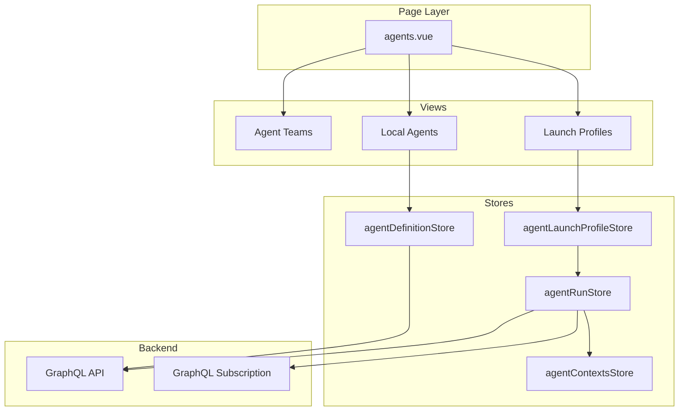
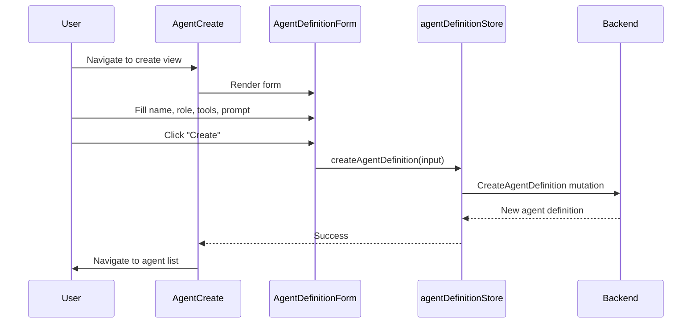
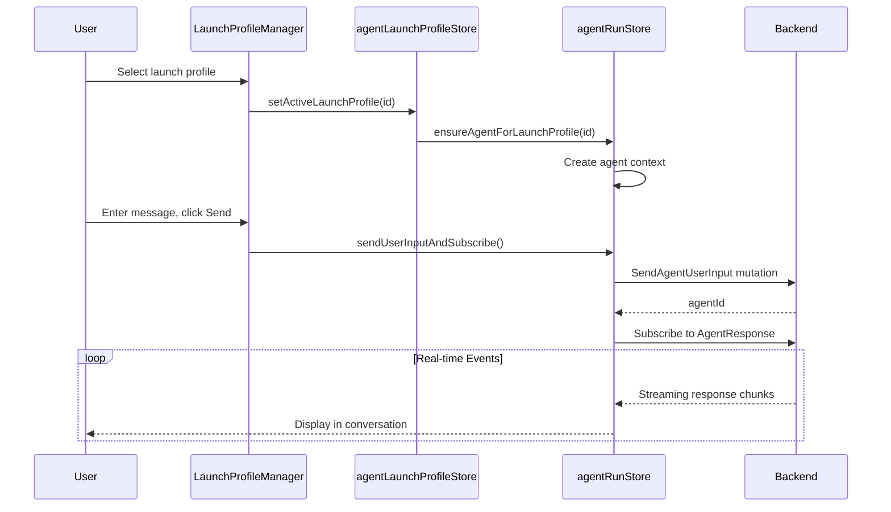

# Agent Management Module - Frontend

This document describes the design and implementation of the **Agent Management** module in the autobyteus-web frontend, which provides agent creation, configuration, launch profiles, and execution capabilities.

## Overview

The Agent Management module enables users to:

- Create and configure agent definitions with tools, processors, and prompts
- Manage launch profiles (saved agent + workspace configurations)
- Run agents with real-time streaming responses
- Approve or reject tool invocations during agent execution
- Handle inactive profiles (workspace no longer exists)
- Create and manage agent teams (multi-agent workflows)

## Module Structure

```
autobyteus-web/
├── pages/
│   └── agents.vue                      # Main agent management page
├── components/agents/
│   ├── AgentList.vue                   # Agent definitions listing
│   ├── AgentCard.vue                   # Individual agent card
│   ├── AgentCreate.vue                 # Create new agent form
│   ├── AgentEdit.vue                   # Edit agent wrapper
│   ├── AgentDetail.vue                 # Agent view with details
│   ├── AgentDefinitionForm.vue         # Shared form for create/edit
│   ├── AgentDeleteConfirmDialog.vue    # Delete confirmation
│   ├── RunningAgentList.vue            # Active agent instances
│   └── RunningAgentCard.vue            # Running agent display
├── components/launchProfiles/
│   ├── LaunchProfileManager.vue        # Main profile management view
│   ├── AgentProfileList.vue            # Profile listing
│   ├── AgentProfileCard.vue            # Individual profile card
│   └── ReactivateAgentProfileDialog.vue # Restore inactive profile
├── components/agentTeams/
│   ├── AgentTeamList.vue               # Team definitions listing
│   ├── AgentTeamCard.vue               # Individual team card
│   ├── AgentTeamCreate.vue             # Create team form
│   ├── AgentTeamEdit.vue               # Edit team wrapper
│   └── AgentTeamDetail.vue             # Team view with details
├── stores/
│   ├── agentDefinitionStore.ts         # Agent definition CRUD
│   ├── agentLaunchProfileStore.ts      # Launch profile management
│   ├── agentRunStore.ts                # Agent execution & subscriptions
│   ├── agentContextsStore.ts           # Running agent state
│   ├── agentTeamDefinitionStore.ts     # Team definition CRUD
│   └── agentTeamLaunchProfileStore.ts  # Team launch profiles
├── types/
│   └── AgentLaunchProfile.ts           # Launch profile type
└── graphql/
    ├── queries/agentDefinitionQueries.ts
    ├── mutations/agentDefinitionMutations.ts
    ├── mutations/agentMutations.ts
    └── subscriptions/agent_response_subscriptions.ts
```

## Architecture



## View Modes

The agents page uses URL query parameters for navigation:

| View              | Component            | Description                          |
| ----------------- | -------------------- | ------------------------------------ |
| `launch-profiles` | LaunchProfileManager | Manage saved agent+workspace configs |
| `list`            | AgentList            | Browse agent definitions             |
| `create`          | AgentCreate          | Create new agent definition          |
| `detail`          | AgentDetail          | View agent details                   |
| `edit`            | AgentEdit            | Edit agent definition                |
| `team-list`       | AgentTeamList        | Browse agent teams                   |
| `team-create`     | AgentTeamCreate      | Create new team                      |
| `team-detail`     | AgentTeamDetail      | View team details                    |
| `team-edit`       | AgentTeamEdit        | Edit team definition                 |

## Data Models

### AgentDefinition

```typescript
interface AgentDefinition {
  id: string;
  name: string;
  role: string;
  description: string;
  toolNames: string[];
  inputProcessorNames: string[];
  llmResponseProcessorNames: string[];
  systemPromptProcessorNames: string[];
  toolExecutionResultProcessorNames: string[];
  toolInvocationPreprocessorNames: string[];
  phaseHookNames: string[];
  systemPromptCategory?: string;
  systemPromptName?: string;
  prompts?: Prompt[];
}
```

### AgentLaunchProfile

```typescript
interface AgentLaunchProfile {
  id: string;
  workspaceId: string | null;
  agentDefinition: AgentDefinition;
  name: string; // e.g., "Code Assistant @ my-project"
  createdAt: string;
  workspaceConfig: any; // Saved workspace configuration
}
```

## State Management

### agentDefinitionStore.ts

Manages agent definition CRUD operations:

```typescript
interface AgentDefinitionState {
  agentDefinitions: AgentDefinition[];
  loading: boolean;
  error: any;
}
```

**Actions:**

| Action                         | Description                        |
| ------------------------------ | ---------------------------------- |
| `fetchAllAgentDefinitions()`   | Load all definitions (cache-first) |
| `reloadAllAgentDefinitions()`  | Force network reload               |
| `createAgentDefinition(input)` | Create new agent                   |
| `updateAgentDefinition(input)` | Update existing agent              |
| `deleteAgentDefinition(id)`    | Delete agent definition            |

### agentLaunchProfileStore.ts

Manages launch profiles with localStorage persistence:

```typescript
interface AgentLaunchProfileState {
  activeLaunchProfiles: Record<string, AgentLaunchProfile>;
  inactiveLaunchProfiles: Record<string, AgentLaunchProfile>;
}
```

**Key Concepts:**

- **Active profiles**: Workspace exists and is connected
- **Inactive profiles**: Original workspace was deleted (can be reactivated)
- Profiles persist to `localStorage` for cross-session continuity

**Actions:**

| Action                                     | Description                                      |
| ------------------------------------------ | ------------------------------------------------ |
| `createLaunchProfile(...)`                 | Create new profile with agent + workspace        |
| `deleteLaunchProfile(id)`                  | Remove profile                                   |
| `activateByCreatingWorkspace(id)`          | Restore inactive profile by recreating workspace |
| `activateByAttachingToWorkspace(id, wsId)` | Attach inactive profile to existing workspace    |
| `setActiveLaunchProfile(id)`               | Select profile for agent run                     |

### agentRunStore.ts

Handles agent execution and real-time communication:

**Actions:**

| Action                              | Description                                    |
| ----------------------------------- | ---------------------------------------------- |
| `sendUserInputAndSubscribe()`       | Send input to agent and start subscription     |
| `subscribeToAgentResponse(agentId)` | Set up GraphQL subscription for events         |
| `postToolExecutionApproval(...)`    | Approve/reject tool invocation                 |
| `closeAgent(agentId, options)`      | Close agent tab, optionally terminate instance |
| `ensureAgentForLaunchProfile(id)`   | Create or attach agent context for profile     |

## GraphQL API

### Agent Definition Queries

```graphql
query GetAgentDefinitions {
  agentDefinitions {
    id, name, role, description
    toolNames, inputProcessorNames, llmResponseProcessorNames
    systemPromptProcessorNames, toolExecutionResultProcessorNames
    toolInvocationPreprocessorNames, phaseHookNames
    systemPromptCategory, systemPromptName
    prompts { id, name, category, ... }
  }
}
```

### Agent Definition Mutations

```graphql
mutation CreateAgentDefinition($input: CreateAgentDefinitionInput!) {
  createAgentDefinition(input: $input) { id, name, ... }
}

mutation UpdateAgentDefinition($input: UpdateAgentDefinitionInput!) {
  updateAgentDefinition(input: $input) { id, name, ... }
}

mutation DeleteAgentDefinition($id: String!) {
  deleteAgentDefinition(id: $id) { success, message }
}
```

### Agent Runtime Mutations

```graphql
mutation SendAgentUserInput($input: SendAgentUserInputInput!) {
  sendAgentUserInput(input: $input) {
    success
    message
    agentId
  }
}

mutation TerminateAgentInstance($id: String!) {
  terminateAgentInstance(id: $id) {
    success
    message
  }
}

mutation ApproveToolInvocation($input: ApproveToolInvocationInput!) {
  approveToolInvocation(input: $input) {
    success
    message
  }
}
```

### Agent Response Subscription

Real-time events from running agents:

```graphql
subscription AgentResponse($agentId: String!) {
  agentResponse(agentId: $agentId) {
    type # thinking, response, tool_call, error, etc.
    content
    metadata
  }
}
```

## User Flows

### Create Agent Definition



### Run Agent with Launch Profile



### Reactivate Inactive Profile

When a workspace is deleted but the profile remains:

1. User clicks on inactive profile
2. ReactivateAgentProfileDialog appears
3. User chooses:
   - **Recreate workspace**: Creates new workspace from saved config
   - **Attach to existing**: Links profile to another workspace
4. Profile moves from `inactiveLaunchProfiles` to `activeLaunchProfiles`

## Agent Definition Form

The `AgentDefinitionForm.vue` component allows configuring:

| Field                            | Description                        |
| -------------------------------- | ---------------------------------- |
| Name                             | Agent display name                 |
| Role                             | Agent's role description           |
| Description                      | Detailed description               |
| System Prompt                    | Category + name of prompt to use   |
| Tools                            | List of tools agent can invoke     |
| Input Processors                 | Transform user input before LLM    |
| LLM Response Processors          | Transform LLM output               |
| System Prompt Processors         | Modify system prompt dynamically   |
| Tool Execution Result Processors | Transform tool outputs             |
| Tool Invocation Preprocessors    | Modify tool calls before execution |
| Phase Hooks                      | Hook into agent execution phases   |

## Related Modules

- **Workspace**: Agents are associated with workspaces for file context
- **Tools**: Agents invoke configured tools during execution
- **Prompts**: System prompts define agent behavior
- **Conversation**: Agent responses displayed in conversation segments
