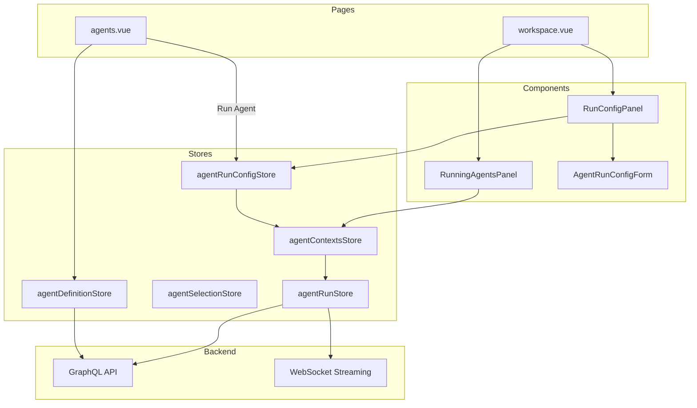
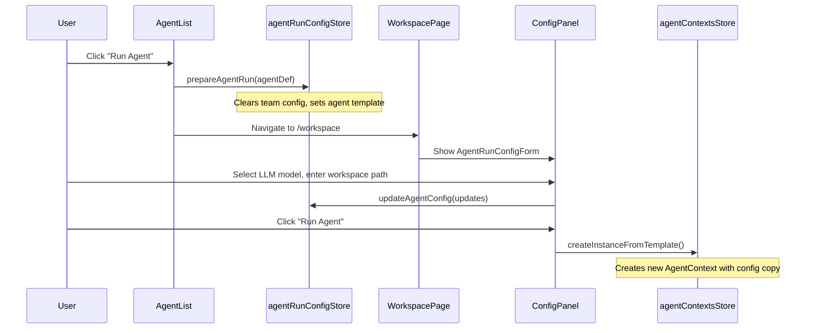
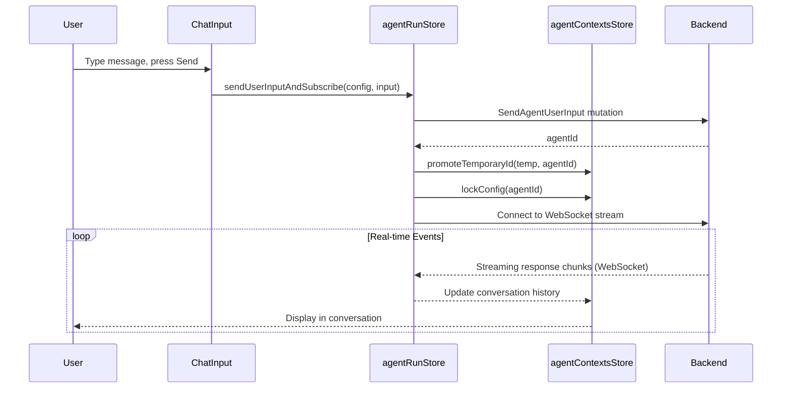

# Agent Management Module - Frontend

This document describes the design and implementation of the **Agent Management** module in the autobyteus-web frontend, including agent definition management, run configurations, and execution capabilities.

## Overview

The Agent Management module enables users to:

- Browse and manage agent definitions (tools, processors, prompts)
- Configure and run agents with ephemeral run configurations
- Run agents with real-time streaming responses
- Approve or reject tool invocations during agent execution
- Create and manage agent teams (multi-agent workflows)

## Module Structure

```
autobyteus-web/
├── pages/
│   ├── agents.vue                      # Agent/Team definitions page
│   └── workspace.vue                   # Main workspace with running agents
├── components/agents/
│   ├── AgentList.vue                   # Agent definitions listing
│   ├── AgentCard.vue                   # Individual agent card
│   ├── AgentCreate.vue                 # Create new agent form
│   ├── AgentEdit.vue                   # Edit agent wrapper
│   ├── AgentDetail.vue                 # Agent view with details
│   ├── AgentDefinitionForm.vue         # Shared form for create/edit
│   └── AgentDeleteConfirmDialog.vue    # Delete confirmation
├── components/workspace/
│   ├── running/
│   │   ├── RunningAgentsPanel.vue      # Panel showing all running instances
│   │   ├── RunningAgentGroup.vue       # Group of instances by definition
│   │   └── RunningInstanceRow.vue      # Individual instance row
│   └── config/
│       ├── RunConfigPanel.vue          # Configuration panel for selected instance
│       ├── AgentRunConfigForm.vue      # Agent configuration form (supports dynamic LLM config schema)
│       ├── TeamRunConfigForm.vue       # Team configuration form
│       └── WorkspacePathInput.vue      # Workspace path input with loading
├── composables/
│   └── useRunActions.ts                # Centralized run preparation logic
├── stores/
│   ├── agentDefinitionStore.ts         # Agent definition CRUD
│   ├── agentRunConfigStore.ts          # Agent run configuration (ephemeral template)
│   ├── agentRunStore.ts                # Agent execution & streaming
│   ├── agentContextsStore.ts           # Running agent instances state
│   ├── agentSelectionStore.ts          # Currently selected instance
│   ├── agentTeamDefinitionStore.ts     # Team definition CRUD
│   ├── teamRunConfigStore.ts           # Team run configuration
│   └── agentTeamContextsStore.ts       # Running team instances state
├── types/agent/
│   ├── AgentRunConfig.ts               # Run configuration type
│   ├── AgentContext.ts                 # Runtime agent context
│   └── AgentRunState.ts                # Agent execution state
└── graphql/
    ├── queries/agentDefinitionQueries.ts
    ├── mutations/agentDefinitionMutations.ts
    └── mutations/agentMutations.ts
```

## Architecture



## Data Models

### AgentDefinition

```typescript
interface AgentDefinition {
  id: string;
  name: string;
  role: string;
  description: string;
  toolNames: string[];
  inputProcessorNames: string[];
  llmResponseProcessorNames: string[];
  systemPromptProcessorNames: string[];
  toolExecutionResultProcessorNames: string[];
  toolInvocationPreprocessorNames: string[];
  lifecycleProcessorNames: string[];
  skillNames: string[];
  prompts?: Prompt[];
}
```

### AgentRunConfig

Ephemeral configuration for running an agent instance:

```typescript
interface AgentRunConfig {
  agentDefinitionId: string;
  agentDefinitionName: string;
  llmModelIdentifier: string;
  workspaceId: string | null;
  autoExecuteTools: boolean;
  llmConfig?: Record<string, unknown>; // Dynamic model parameters (e.g. thinking_level)
  isLocked: boolean; // True once execution starts
}
```

### AgentContext

Runtime state for a running agent instance:

```typescript
interface AgentContext {
  config: AgentRunConfig;
  state: AgentRunState;
}

interface AgentRunState {
  agentId: string;
  currentStreamState: string | null;
  conversationHistory: ConversationEntry[];
}
```

## State Management

### agentDefinitionStore.ts

Manages agent definition CRUD operations:

| Action                         | Description                        |
| ------------------------------ | ---------------------------------- |
| `fetchAllAgentDefinitions()`   | Load all definitions (cache-first) |
| `reloadAllAgentDefinitions()`  | Force network reload               |
| `createAgentDefinition(input)` | Create new agent                   |
| `updateAgentDefinition(input)` | Update existing agent              |
| `deleteAgentDefinition(id)`    | Delete agent definition            |

### agentRunConfigStore.ts

Manages the **ephemeral template** for configuring a new agent run:

| Action                         | Description                             |
| ------------------------------ | --------------------------------------- |
| `setTemplate(agentDef)`        | Initialize config from agent definition |
| `updateAgentConfig(updates)`   | Update config fields                    |
| `setWorkspaceLoaded(id, path)` | Set loaded workspace ID and path        |
| `clearConfig()`                | Clear the configuration buffer          |

| Getter         | Description                           |
| -------------- | ------------------------------------- |
| `hasConfig`    | Whether a config template is active   |
| `isConfigured` | Whether LLM model is selected (ready) |

### agentContextsStore.ts

Manages **running agent instances**:

| Action                           | Description                                |
| -------------------------------- | ------------------------------------------ |
| `createInstanceFromTemplate()`   | Create instance from `agentRunConfigStore` |
| `removeInstance(id)`             | Remove agent instance                      |
| `lockConfig(id)`                 | Lock config after first message            |
| `promoteTemporaryId(temp, perm)` | Replace temp ID with server ID             |

| Getter                  | Description                 |
| ----------------------- | --------------------------- |
| `activeInstance`        | Currently selected instance |
| `instancesByDefinition` | Grouped by agent definition |

### agentRunStore.ts

Handles agent execution and real-time communication:

| Action                           | Description                                |
| -------------------------------- | ------------------------------------------ |
| `sendUserInputAndSubscribe()`    | Send input and connect WebSocket stream    |
| `connectToAgentStream(agentId)`  | Open WebSocket stream for events           |
| `postToolExecutionApproval(...)` | Approve/reject tool invocation             |
| `closeAgent(agentId, options)`   | Close agent, optionally terminate instance |

## User Flows

### Run Agent from Agent List



### Send Message to Agent



## useRunActions Composable

Centralized logic for starting agent or team runs:

```typescript
export function useRunActions() {
  const prepareAgentRun = (agentDef: AgentDefinition) => {
    teamRunConfigStore.clearConfig(); // Clear team config
    agentRunConfigStore.setTemplate(agentDef);
    selectionStore.clearSelection();
  };

  const prepareTeamRun = (teamDef: AgentTeamDefinition) => {
    agentRunConfigStore.clearConfig(); // Clear agent config
    teamRunConfigStore.setTemplate(teamDef);
    selectionStore.clearSelection();
  };

  return { prepareAgentRun, prepareTeamRun };
}
```

This ensures **mutual exclusivity**: only one config (agent or team) is active at a time.

## Agent Definition Form

The `AgentDefinitionForm.vue` component allows configuring:

| Field                            | Description                        |
| -------------------------------- | ---------------------------------- |
| Name                             | Agent display name                 |
| Role                             | Agent's role description           |
| Description                      | Detailed description               |
| System Prompt                    | Category + name of prompt to use   |
| Tools                            | List of tools agent can invoke     |
| Input Processors                 | Transform user input before LLM    |
| LLM Response Processors          | Transform LLM output               |
| System Prompt Processors         | Modify system prompt dynamically   |
| Tool Execution Result Processors | Transform tool outputs             |
| Tool Invocation Preprocessors    | Modify tool calls before execution |
| Lifecycle Processors             | Hook into agent lifecycle events   |
| Skills                           | File-based capabilities (scripts)  |

## Related Documentation

- **[Agent Teams](./agent_teams.md)**: Agents can be combined into teams for complex workflows.
- **[Skills](./skills.md)**: Agents can be equipped with file-based skills (scripts).
- **[Tools & MCP](./tools_and_mcp.md)**: Agents invoke configured tools and MCP servers during execution.
- **[Prompt Engineering](./prompt_engineering.md)**: System prompts define the core persona and behavior of the agent.
- **[Settings](./settings.md)**: API keys for LLMs must be configured in Settings.
