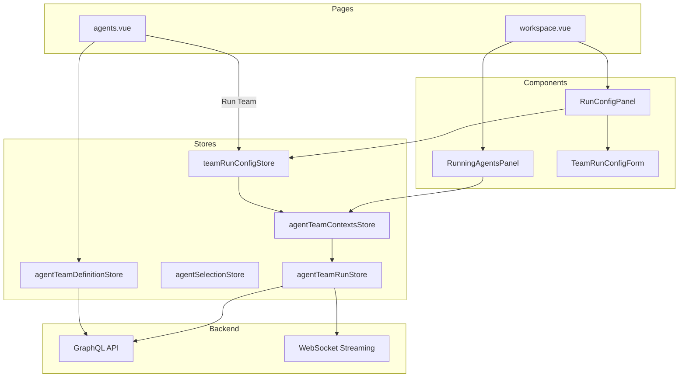
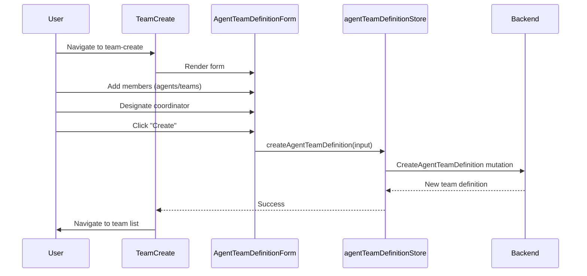
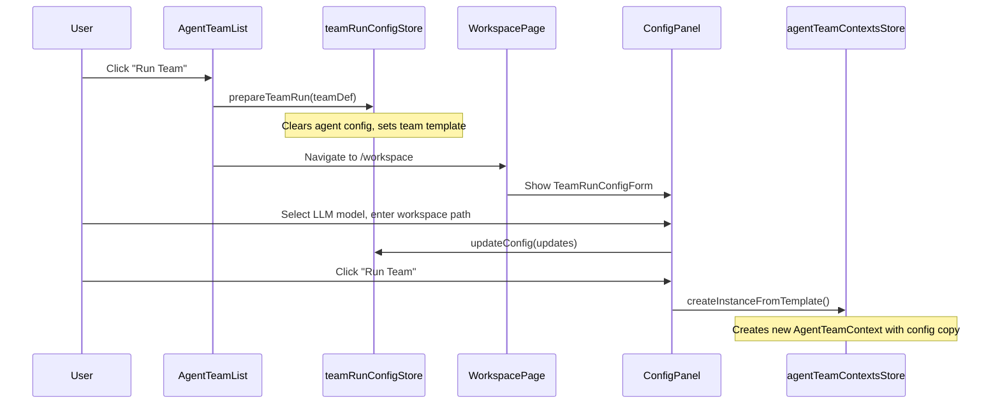
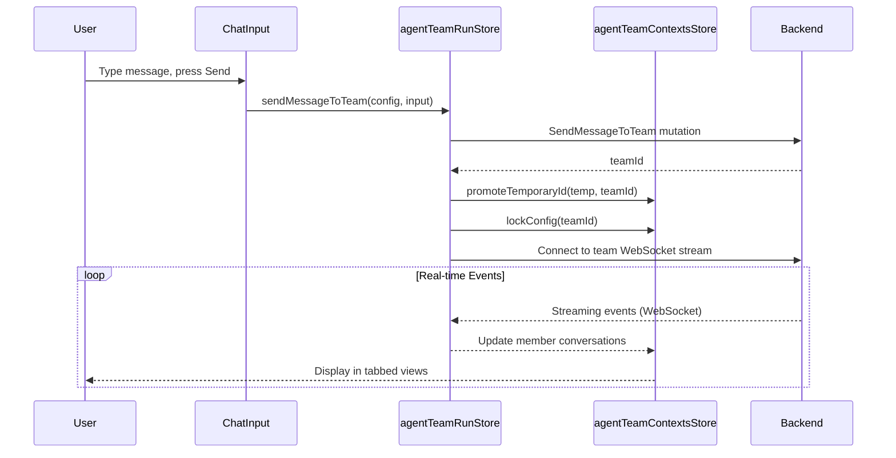

# Agent Teams Module - Frontend

This document describes the design and implementation of the **Agent Teams** module in the autobyteus-web frontend, which enables creating, configuring, and running multi-agent teams with shared configurations.

## Overview

The Agent Teams module enables users to:

- Create team definitions with multiple agent members
- Designate a coordinator member for team orchestration
- Support nested teams (teams containing other teams)
- Configure global settings and per-member overrides via run configurations
- Launch teams with real-time streaming responses
- Monitor individual agent activities within a team

## Module Structure

```
autobyteus-web/
├── pages/
│   ├── agents.vue                      # Agent/Team definitions page
│   └── workspace.vue                   # Main workspace with running teams
├── components/agentTeams/
│   ├── AgentTeamList.vue               # Team definitions listing
│   ├── AgentTeamCard.vue               # Individual team card
│   ├── AgentTeamCreate.vue             # Create new team form
│   ├── AgentTeamEdit.vue               # Edit team wrapper
│   ├── AgentTeamDetail.vue             # Team view with details
│   ├── AgentTeamDefinitionForm.vue     # Shared form for create/edit
│   └── SearchableGroupedSelect.vue     # Agent/team selector
├── components/workspace/
│   ├── running/
│   │   ├── RunningAgentsPanel.vue      # Panel showing all running instances
│   │   ├── RunningTeamGroup.vue        # Group of team instances
│   │   ├── RunningTeamRow.vue          # Team instance with expandable members
│   │   ├── TeamMemberRow.vue           # Individual team member row
│   │   └── AgentPickerDropdown.vue     # Dropdown to start new agent/team
│   ├── config/
│   │   ├── RunConfigPanel.vue          # Configuration panel
│   │   └── TeamRunConfigForm.vue       # Team configuration form
│   └── team/
│       ├── AgentTeamEventMonitor.vue   # Team execution monitor
│       └── AgentTeamEventMonitorTabs.vue # Tabbed member views
├── composables/
│   └── useRunActions.ts                # Centralized run preparation logic
├── stores/
│   ├── agentTeamDefinitionStore.ts     # Team definition CRUD
│   ├── teamRunConfigStore.ts           # Team run configuration (ephemeral)
│   ├── agentTeamRunStore.ts            # Team execution & streaming
│   └── agentTeamContextsStore.ts       # Running team instances state
├── types/agent/
│   └── TeamRunConfig.ts                # Run configuration type
└── graphql/
    ├── queries/agentTeamDefinitionQueries.ts
    ├── mutations/agentTeamDefinitionMutations.ts
    └── mutations/agentTeamInstanceMutations.ts
```

## Architecture



## Key Concepts

### Team Members

Each team consists of **nodes** (members) that can be:

- **Agents**: Individual agent definitions
- **Nested Teams**: Other team definitions (composable)

```typescript
interface TeamMember {
  memberName: string; // Unique identifier within team
  referenceId: string; // ID of agent or team
  referenceType: "AGENT" | "AGENT_TEAM";
}
```

### Coordinator

Each team has a **coordinator member** (`coordinatorMemberName`) that:

- Orchestrates team execution
- Receives initial user input
- Coordinates responses between members

## Data Models

### AgentTeamDefinition

```typescript
interface AgentTeamDefinition {
  id: string;
  name: string;
  description: string;
  role?: string;
  coordinatorMemberName: string;
  nodes: {
    memberName: string;
    referenceId: string;
    referenceType: "AGENT" | "AGENT_TEAM";
  }[];
}
```

### TeamRunConfig

Ephemeral configuration for running a team instance:

```typescript
interface TeamRunConfig {
  teamDefinitionId: string;
  teamDefinitionName: string;

  // Global settings (applied to all members)
  workspaceId: string | null;
  llmModelIdentifier: string;
  autoExecuteTools: boolean;

  // Per-member overrides
  memberOverrides: Record<string, MemberConfigOverride>;

  isLocked: boolean; // True once execution starts
}

interface MemberConfigOverride {
  agentDefinitionId: string;
  llmModelIdentifier?: string;
  autoExecuteTools?: boolean;
  llmConfig?: Record<string, unknown>;
}
```

### AgentTeamContext

Runtime state for a running team instance:

```typescript
interface AgentTeamContext {
  config: TeamRunConfig;
  memberContexts: Map<string, MemberAgentContext>;
  status: "configuring" | "running" | "completed" | "error";
}
```

## State Management

### agentTeamDefinitionStore.ts

Manages team definition CRUD:

| Action                             | Description                        |
| ---------------------------------- | ---------------------------------- |
| `fetchAllAgentTeamDefinitions()`   | Load all definitions (cache-first) |
| `reloadAllAgentTeamDefinitions()`  | Force network reload               |
| `createAgentTeamDefinition(input)` | Create new team                    |
| `updateAgentTeamDefinition(input)` | Update existing team               |
| `deleteAgentTeamDefinition(id)`    | Delete team definition             |

### teamRunConfigStore.ts

Manages the **ephemeral template** for configuring a new team run:

| Action                         | Description                            |
| ------------------------------ | -------------------------------------- |
| `setTemplate(teamDef)`         | Initialize config from team definition |
| `updateConfig(updates)`        | Update config fields                   |
| `setWorkspaceLoaded(id, path)` | Set loaded workspace ID and path       |
| `clearConfig()`                | Clear the configuration buffer         |

| Getter         | Description                           |
| -------------- | ------------------------------------- |
| `hasConfig`    | Whether a config template is active   |
| `isConfigured` | Whether LLM model is selected (ready) |

### agentTeamContextsStore.ts

Manages **running team instances**:

| Action                           | Description                               |
| -------------------------------- | ----------------------------------------- |
| `createInstanceFromTemplate()`   | Create instance from `teamRunConfigStore` |
| `removeTeam(id)`                 | Remove team instance                      |
| `lockConfig(id)`                 | Lock config after first message           |
| `promoteTemporaryId(temp, perm)` | Replace temp ID with server ID            |

Note: While a team is still local-only (ID starts with `temp-`), the UI labels it as **"New - {TeamName}"** instead of showing the raw temp ID.

### agentTeamRunStore.ts

Handles team execution and real-time communication:

| Action                            | Description                         |
| --------------------------------- | ----------------------------------- |
| `sendMessageToTeam(...)`          | Send user input to team coordinator |
| `connectToTeamStream(teamId)`     | Connect to team WebSocket events    |
| `terminateTeamInstance(teamId)`   | Stop running team instance          |
| `sendMessageToFocusedMember(...)` | Send message to specific member     |

## User Flows

### Create Agent Team



### Run Team from Team List



### Send Message to Team



## Team Run Configuration Form

The `TeamRunConfigForm.vue` provides configuration options:

### Global Settings Section

| Field              | Description                      |
| ------------------ | -------------------------------- |
| Team Name          | Read-only, from definition       |
| Members            | Read-only, shows member initials |
| Default LLM Model  | Dropdown, applied to all members |
| Workspace Path     | Input with load button           |
| Auto-execute Tools | Checkbox                         |

### Member Overrides Section (Collapsible)

- Expandable list of all team members
- Per-member override options:
  - Different LLM model
  - Model parameters (e.g. thinking level) - Dynamically generated form
  - Different tool execution settings

## Configuration Hierarchy

When running a team, configuration is resolved in this order:

1. **Global config** - Applies to all members by default
2. **Member overrides** - Override specific members' settings

```
TeamRunConfig
├── llmModelIdentifier: "gpt-4o"        (Global)
├── workspaceId: "ws-123"               (Shared)
├── autoExecuteTools: true              (Global)
│
└── memberOverrides:
    ├── "code_reviewer":
    │   └── llmModelIdentifier: "claude-3.5"    (Override)
    └── "tester":
        └── autoExecuteTools: false             (Override)
```

## Differences from Single Agents

| Feature       | Single Agent        | Agent Team                     |
| ------------- | ------------------- | ------------------------------ |
| Execution     | One agent runs      | Multiple agents coordinate     |
| Configuration | AgentRunConfig      | TeamRunConfig + overrides      |
| Dependencies  | None                | DAG-based execution order      |
| Monitoring    | Single conversation | Per-member views in left panel |
| Workspace     | One per agent       | Shared or per-member           |

## useRunActions Composable

Both agents and teams use the same composable for starting runs:

```typescript
export function useRunActions() {
  const prepareTeamRun = (teamDef: AgentTeamDefinition) => {
    agentRunConfigStore.clearConfig(); // Clear agent config
    teamRunConfigStore.setTemplate(teamDef);
    selectionStore.clearSelection();
  };

  return { prepareAgentRun, prepareTeamRun };
}
```

This ensures **mutual exclusivity**: only one config (agent or team) is active at a time.

## Related Documentation

- **[Agent Management](./agent_management.md)**: Individual agents are the building blocks of teams.
- **[File Explorer](./file_explorer.md)**: Teams operate within workspaces managed by the File Explorer.
- **[Agent Execution Architecture](./agent_execution_architecture.md)**: Details the underlying execution engine for agents and teams.
