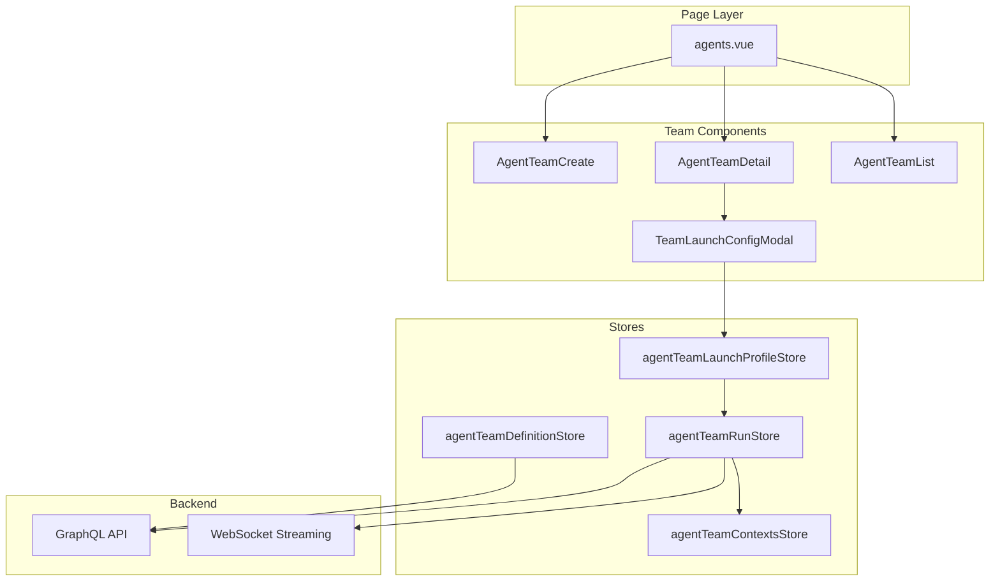
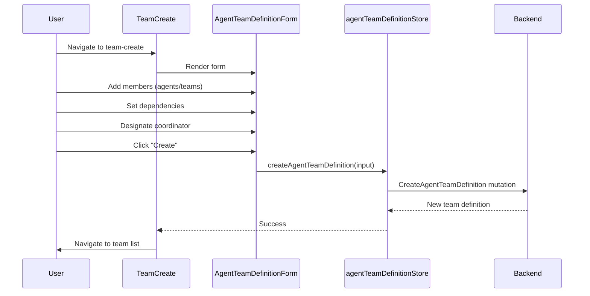
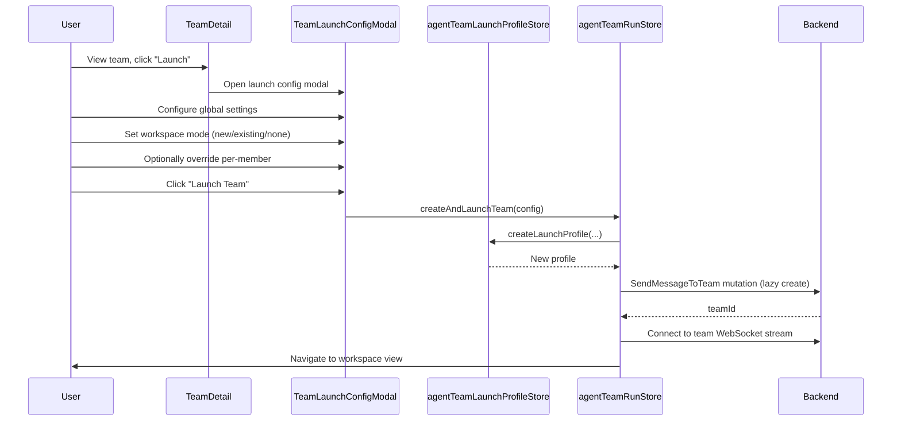

# Agent Teams Module - Frontend

This document describes the design and implementation of the **Agent Teams** module in the autobyteus-web frontend, which enables creating, configuring, and running multi-agent teams with dependencies and shared configurations.

## Overview

The Agent Teams module enables users to:

- Create team definitions with multiple agent members
- Define dependencies between team members (execution order)
- Designate a coordinator member for team orchestration
- Support nested teams (teams containing other teams)
- Configure global settings and per-member overrides
- Launch teams with workspace configuration options
- Monitor individual agent activities within a team

## Module Structure

```
autobyteus-web/
├── pages/
│   └── agents.vue                      # Shared page (team-list, team-detail, etc.)
├── components/agentTeams/
│   ├── AgentTeamList.vue               # Team definitions listing
│   ├── AgentTeamCard.vue               # Individual team card
│   ├── AgentTeamCreate.vue             # Create new team form
│   ├── AgentTeamEdit.vue               # Edit team wrapper
│   ├── AgentTeamDetail.vue             # Team view with details
│   ├── AgentTeamDefinitionForm.vue     # Shared form for create/edit
│   ├── TeamLaunchConfigModal.vue       # Launch configuration wizard
│   ├── SearchableGroupedSelect.vue     # Agent/team selector
│   └── InlineSearchableGroupedList.vue # Inline member list
├── components/workspace/team/
│   ├── AgentTeamEventMonitor.vue       # Team execution monitor
│   └── AgentTeamEventMonitorTabs.vue   # Tabbed member views
├── stores/
│   ├── agentTeamDefinitionStore.ts     # Team definition CRUD
│   ├── agentTeamLaunchProfileStore.ts  # Team launch profile management
│   ├── agentTeamRunStore.ts            # Team execution & streaming
│   └── agentTeamContextsStore.ts       # Running team state
├── types/
│   └── TeamLaunchProfile.ts            # Launch profile types
└── graphql/
    ├── queries/agentTeamDefinitionQueries.ts
    ├── mutations/agentTeamDefinitionMutations.ts
    └── mutations/agentTeamInstanceMutations.ts
```

## Architecture



## Key Concepts

### Team Members

Each team consists of **nodes** (members) that can be:

- **Agents**: Individual agent definitions
- **Nested Teams**: Other team definitions (composable)

```typescript
interface TeamMember {
  memberName: string; // Unique identifier within team
  referenceId: string; // ID of agent or team
  referenceType: "AGENT" | "AGENT_TEAM";
  dependencies: string[]; // Member names this depends on
}
```

### Coordinator

Each team has a **coordinator member** (`coordinatorMemberName`) that:

- Orchestrates team execution
- Receives initial user input
- Coordinates responses between members

### Dependencies

Members can declare dependencies on other members:

- Dependencies define execution order
- A member only starts after its dependencies complete
- Enables DAG-based (Directed Acyclic Graph) workflows

## Data Models

### AgentTeamDefinition

```typescript
interface AgentTeamDefinition {
  id: string;
  name: string;
  description: string;
  role?: string;
  coordinatorMemberName: string;
  nodes: {
    memberName: string;
    referenceId: string;
    referenceType: "AGENT" | "AGENT_TEAM";
    dependencies: string[];
  }[];
}
```

### TeamLaunchProfile

```typescript
interface TeamLaunchProfile {
  id: string;
  name: string;
  createdAt: string;
  teamDefinition: AgentTeamDefinition; // Snapshot copy

  globalConfig: {
    llmModelIdentifier: string;
    workspaceConfig: WorkspaceLaunchConfig;
    autoExecuteTools: boolean;

    taskNotificationMode: "AGENT_MANUAL_NOTIFICATION" | "SYSTEM_EVENT_DRIVEN";
    useXmlToolFormat: boolean;
  };

  memberOverrides: TeamMemberConfigOverride[];
}
```

### WorkspaceLaunchConfig

Defines how workspace is configured for team launch:

```typescript
interface WorkspaceLaunchConfig {
  mode: "new" | "existing" | "none";
  existingWorkspaceId?: string;
  newWorkspaceConfig?: {
    root_path: string;
  };
}
```

### TeamMemberConfigOverride

Per-member configuration overrides:

```typescript
interface TeamMemberConfigOverride {
  memberName: string;
  llmModelIdentifier?: string;
  workspaceConfig?: WorkspaceLaunchConfig;
  autoExecuteTools?: boolean;
}
```

## State Management

### agentTeamDefinitionStore.ts

Manages team definition CRUD:

**Actions:**

| Action                             | Description                        |
| ---------------------------------- | ---------------------------------- |
| `fetchAllAgentTeamDefinitions()`   | Load all definitions (cache-first) |
| `reloadAllAgentTeamDefinitions()`  | Force network reload               |
| `createAgentTeamDefinition(input)` | Create new team                    |
| `updateAgentTeamDefinition(input)` | Update existing team               |
| `deleteAgentTeamDefinition(id)`    | Delete team definition             |

### agentTeamLaunchProfileStore.ts

Manages team launch profiles with localStorage:

**State:**

```typescript
interface AgentTeamLaunchProfileState {
  profiles: Record<string, TeamLaunchProfile>;
}
```

**Actions:**

| Action                                 | Description                     |
| -------------------------------------- | ------------------------------- |
| `loadLaunchProfiles()`                 | Load profiles from localStorage |
| `createLaunchProfile(teamDef, config)` | Create new launch profile       |
| `deleteLaunchProfile(id)`              | Remove profile                  |
| `setActiveLaunchProfile(id)`           | Select profile for execution    |

**Getters:**

| Getter                   | Description                        |
| ------------------------ | ---------------------------------- |
| `activeLaunchProfiles`   | Profiles with running instances    |
| `inactiveLaunchProfiles` | Profiles without running instances |

### agentTeamRunStore.ts

Handles team execution and real-time communication:

**Actions:**

| Action                            | Description                                 |
| --------------------------------- | ------------------------------------------- |
| `createAndLaunchTeam(config)`     | Create profile and launch (creation flow)   |
| `launchExistingTeam(profileId)`   | Launch existing profile (reactivation flow) |
| `createNewTeamInstance()`         | Create new instance for active profile      |
| `connectToTeamStream(teamId)`     | Connect to team WebSocket events            |
| `terminateTeamInstance(teamId)`   | Stop running team instance                  |
| `sendMessageToFocusedMember(...)` | Send message to specific member             |

## GraphQL API

### Team Definition Queries

```graphql
query GetAgentTeamDefinitions {
  agentTeamDefinitions {
    id
    name
    description
    role
    coordinatorMemberName
    nodes {
      memberName
      referenceId
      referenceType
      dependencies
    }
  }
}
```

### Team Definition Mutations

```graphql
mutation CreateAgentTeamDefinition($input: CreateAgentTeamDefinitionInput!) {
  createAgentTeamDefinition(input: $input) {
    id
    name
  }
}

mutation UpdateAgentTeamDefinition($input: UpdateAgentTeamDefinitionInput!) {
  updateAgentTeamDefinition(input: $input) {
    id
    name
  }
}

mutation DeleteAgentTeamDefinition($id: String!) {
  deleteAgentTeamDefinition(id: $id) {
    success
    message
  }
}
```

### Team Instance Mutations

```graphql
mutation SendMessageToTeam($input: SendMessageToTeamInput!) {
  sendMessageToTeam(input: $input) {
    success
    message
    teamId
  }
}

mutation TerminateAgentTeamInstance($id: String!) {
  terminateAgentTeamInstance(id: $id) {
    success
    message
  }
}
```

## User Flows

### Create Agent Team



### Launch Agent Team



### Configuration Hierarchy

When launching a team, configuration is resolved in this order:

1. **Global config** - Applies to all members by default
2. **Member overrides** - Override specific members' settings

```
GlobalConfig
├── llmModelIdentifier: "gpt-4o"
├── workspaceConfig: { mode: "new", ... }
├── autoExecuteTools: true
└── ...

MemberOverrides
├── [0] memberName: "code_reviewer"
│   └── llmModelIdentifier: "claude-3.5-sonnet"  ← Override
├── [1] memberName: "tester"
│   └── workspaceConfig: { mode: "existing", id: "..." }  ← Override
```

## Team Launch Configuration Modal

The `TeamLaunchConfigModal.vue` provides a comprehensive wizard:

### Step 1: Global Configuration

- Profile name
- LLM model selection
- Workspace mode (new/existing/none)
- Auto-execute tools toggle

- Task notification mode
- XML tool format toggle

### Step 2: Per-Member Overrides (Optional)

- List of all team members
- Override individual settings:
  - Different LLM model
  - Different workspace
  - Different tool execution settings

### Step 3: Review & Launch

- Summary of configuration
- Launch button

## Differences from Single Agents

| Feature       | Single Agent             | Agent Team                    |
| ------------- | ------------------------ | ----------------------------- |
| Execution     | One agent runs           | Multiple agents coordinate    |
| Configuration | Simple agent + workspace | Global + per-member overrides |
| Dependencies  | None                     | DAG-based execution order     |
| Monitoring    | Single conversation      | Tabbed per-member views       |
| Workspace     | One per agent            | Per-member or shared          |

## Related Documentation

- **[Agent Management](./agent_management.md)**: Individual agents are the building blocks of teams.
- **[File Explorer](./file_explorer.md)**: Teams operate within workspaces managed by the File Explorer.
- **[Agent Execution Architecture](./agent_execution_architecture.md)**: Details the underlying execution engine for agents and teams.
