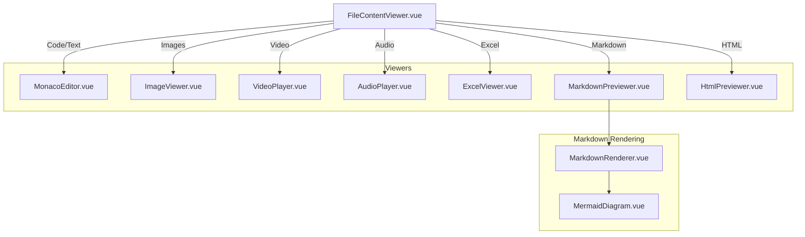

# File Content Rendering

This document describes how file content is rendered in the AutoByteus frontend, including the architecture of the content viewer and details on specific renderers like Markdown and Mermaid.

## Overview

The **FileContentViewer** component is responsible for displaying the content of files selected in the File Explorer. It provides a multi-tab interface, supports various file types, and allows for editing (for text/code files) or previewing (for rich media).

## Architecture

The rendering system follows a strategy pattern where the file extension determines the specific viewer component to use.



## Supported File Types

| Type      | Extensions                      | Viewer Component  |
| --------- | ------------------------------- | ----------------- |
| Text/Code | `.js`, `.py`, `.ts`, etc.       | MonacoEditor      |
| Image     | `.jpg`, `.png`, `.gif`, `.webp` | ImageViewer       |
| Video     | `.mp4`, `.mov`, `.webm`         | VideoPlayer       |
| Audio     | `.mp3`, `.wav`, `.m4a`          | AudioPlayer       |
| Markdown  | `.md`, `.markdown`              | MarkdownPreviewer |
| HTML      | `.html`, `.htm`                 | HtmlPreviewer     |
| Excel     | `.xlsx`, `.xls`, `.csv`         | ExcelViewer       |

## Markdown Rendering

Markdown files are rendered using `MarkdownRenderer.vue`, which uses `markdown-it` for parsing. The parsing logic is encapsulated in `useMarkdownSegments.ts`.

### Features

- **Standard Markdown**: CommonMark compliant.
- **Syntax Highlighting**: Uses PrismJS for code blocks.
- **Math Support**: Uses KaTeX for LaTeX equations (blocks enclosed in `$$` or `math` fences).
- **Mermaid Diagrams**: Native support for Mermaid diagrams.

### Mermaid Support

AutoByteus supports rendering Mermaid diagrams directly within markdown files. This is handled by a custom client-side renderer that replaces the need for backend generation (like PlantUML).

**Usage:**

````markdown

````

**Implementation Details:**

1.  **Parsing**: `useMarkdownSegments.ts` detects code fences with the language `mermaid` or `mmd`.
2.  **Rendering**: The `MermaidDiagram.vue` component receives the diagram text.
3.  **Service**: `mermaidService.ts` wraps the `mermaid` library to initialize settings (theme, security) and generate the SVG.

This architecture ensures that diagram rendering is:

- **Fast**: Client-side only, no network requests to generate images.
- **Secure**: Uses `securityLevel: 'loose'` but runs in the browser sandbox (note: 'loose' allows HTML in labels).
- **Theme-aware**: Can adapt to the application's light/dark mode.
