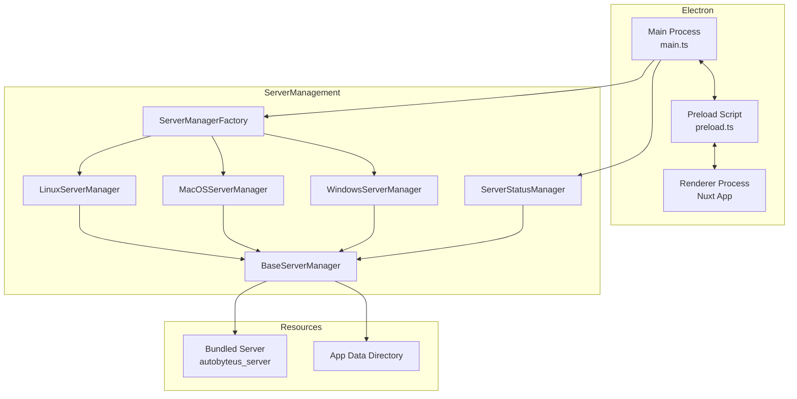
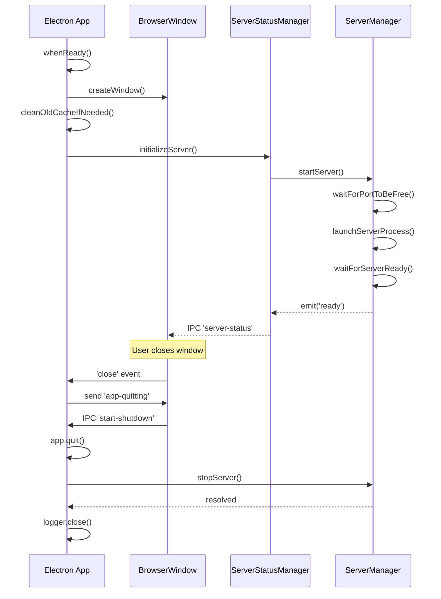

# Electron Packaging and Server Management

This document describes the design and implementation of the **Electron desktop packaging** in autobyteus-web, which bundles and manages a local Python backend server for a fully self-contained desktop application.

## Overview

AutoByteus is packaged as an Electron application that:

- Provides a native desktop experience across Windows, macOS, and Linux
- Bundles a pre-compiled Python backend server (compiled via Nuitka)
- Manages the server lifecycle automatically
- Uses IPC for secure communication between main and renderer processes

## Architecture



## Directory Structure

```
autobyteus-web/
├── electron/
│   ├── main.ts                 # Main process entry point
│   ├── preload.ts              # Secure API bridge to renderer
│   ├── logger.ts               # File and console logging
│   ├── types.d.ts              # TypeScript definitions
│   ├── server/
│   │   ├── baseServerManager.ts      # Abstract base class
│   │   ├── linuxServerManager.ts     # Linux implementation
│   │   ├── macOSServerManager.ts     # macOS implementation
│   │   ├── windowsServerManager.ts   # Windows implementation
│   │   ├── serverManagerFactory.ts   # Factory pattern
│   │   ├── serverStatusManager.ts    # Status bridge/events
│   │   ├── serverStatusEnum.ts       # Status enum
│   │   ├── services/                 # Extracted services
│   │   │   ├── AppDataService.ts     # Directory/config management
│   │   │   ├── HealthChecker.ts      # Health polling logic
│   │   │   └── index.ts              # Service exports
│   │   └── __tests__/                # Server tests
│   └── utils/
│       ├── networkUtils.ts     # Local IP detection
│       ├── shellEnv.ts         # PATH from login shell
│       └── __tests__/          # Utils tests
├── build/
│   ├── scripts/
│   │   ├── build.ts            # electron-builder script
│   │   └── generateIcons.ts    # Icon generation
│   └── icons/                  # Platform-specific icons
└── resources/
    └── server/                 # Bundled Python server
```

---

## Server Manager System

### BaseServerManager

Abstract class providing platform-agnostic server lifecycle management:

| Method            | Description                             |
| ----------------- | --------------------------------------- |
| `startServer()`   | Initialize and start the backend server |
| `stopServer()`    | Gracefully stop the server process      |
| `isRunning()`     | Check if server is running and ready    |
| `getServerUrls()` | Get all API endpoint URLs               |
| `getServerPort()` | Return the fixed port (29695)           |
| `getCacheDir()`   | Platform-specific cache directory       |
| `getAppDataDir()` | Application data directory              |

Key features:

- **EventEmitter-based**: Emits `ready`, `error`, and `stopped` events
- **Fixed port**: Uses port `29695` for the server
- **First-run initialization**: Copies required config files on first launch
- **Validation**: Checks for required server files before starting
- **Port waiting**: Ensures port is free before binding

### Platform-Specific Managers

| Platform | Class                  | Executable              | Cache Dir                   |
| -------- | ---------------------- | ----------------------- | --------------------------- |
| Linux    | `LinuxServerManager`   | `autobyteus_server`     | `~/.cache/autobyteus`       |
| macOS    | `MacOSServerManager`   | `autobyteus_server.app` | `~/.cache/autobyteus`       |
| Windows  | `WindowsServerManager` | `autobyteus_server.exe` | `%LOCALAPPDATA%\autobyteus` |

Each extends `BaseServerManager` and implements:

- `getServerPath()` - Returns path to platform-specific executable
- `launchServerProcess()` - Spawns the server with correct environment
- `getCacheDir()` - Returns platform-specific cache location

### ServerStatusManager

Bridges server events to the renderer process:

```typescript
// Events emitted to renderer via IPC
interface ServerStatusEvent {
  status: "starting" | "running" | "error" | "restarting" | "shutting-down";
  urls: { graphql; rest; ws; transcription; health };
  message?: string;
  healthCheckStatus?: string;
}
```

Methods:

- `initializeServer()` - Start server on app launch
- `restartServer()` - Stop and restart the server
- `checkServerHealth()` - Ping health endpoint
- `getStatus()` - Return current status object

---

## Main Process (main.ts)

### Window Creation

- Creates a secure `BrowserWindow` with sandbox enabled
- Blocks unintended navigations and new windows for security
- Registers custom `local-file://` protocol for secure local media access

### IPC Handlers

| Handler                | Purpose                          |
| ---------------------- | -------------------------------- |
| `get-server-status`    | Return current server status     |
| `restart-server`       | Restart the backend server       |
| `check-server-health`  | Ping server health endpoint      |
| `get-log-file-path`    | Get path to app log file         |
| `open-log-file`        | Open log file in system editor   |
| `read-log-file`        | Read last 500 lines of log       |
| `read-local-text-file` | Securely read local file content |
| `open-external-link`   | Open URL in system browser       |
| `clear-app-cache`      | Clear Nuitka extraction cache    |
| `reset-server-data`    | Clear server data directory      |
| `get-platform`         | Return OS platform string        |

### App Lifecycle



---

## Preload Script (preload.ts)

Exposes a secure `electronAPI` to the renderer process via `contextBridge`:

```typescript
window.electronAPI = {
  // Server control
  getServerStatus: () => Promise<ServerStatus>,
  restartServer: () => Promise<ServerStatus>,
  checkServerHealth: () => Promise<HealthStatus>,
  onServerStatus: (callback) => () => void,

  // File operations
  getLogFilePath: () => Promise<string>,
  openLogFile: (path) => Promise<Result>,
  readLogFile: (path) => Promise<Result>,
  readLocalTextFile: (path) => Promise<Result>,
  getPathForFile: (file: File) => string,

  // System
  openExternalLink: (url) => Promise<Result>,
  getPlatform: () => Promise<string>,

  // Recovery
  clearAppCache: () => Promise<Result>,
  resetServerData: () => Promise<Result>,

  // Shutdown
  onAppQuitting: (callback) => void,
  startShutdown: () => void,
}
```

---

## Build System

### electron-builder Configuration

Located in `build/scripts/build.ts`:

```typescript
const options: Configuration = {
  appId: "com.autobyteus.app",
  productName: "AutoByteus",
  directories: { output: "electron-dist" },
  files: ["dist/**/*", "package.json"],
  extraMetadata: { main: "dist/electron/main.js" },
  asar: true,
  extraResources: [
    { from: "resources/server", to: "server" },
    { from: "build/icons", to: "icons" },
  ],
  // Platform-specific configurations...
};
```

### Platform Targets

| Platform | Target         | Artifact Pattern                        |
| -------- | -------------- | --------------------------------------- |
| Linux    | AppImage       | `AutoByteus_linux-{version}.AppImage`   |
| Windows  | NSIS installer | `AutoByteus_windows-{version}.exe`      |
| macOS    | ZIP archive    | `AutoByteus_macos-{arch}-{version}.zip` |

### Build Commands

```bash
# Build for current platform
npx ts-node build/scripts/build.ts

# Build for specific platform
npx ts-node build/scripts/build.ts --linux
npx ts-node build/scripts/build.ts --windows
npx ts-node build/scripts/build.ts --mac

# Build for all platforms
npx ts-node build/scripts/build.ts
```

---

## Server Resource Packaging

The bundled server is located at `resources/server/` and includes:

| File/Directory                 | Purpose                             |
| ------------------------------ | ----------------------------------- |
| `autobyteus_server[.exe/.app]` | Compiled Python executable (Nuitka) |
| `alembic/`                     | Database migration scripts          |
| `alembic.ini`                  | Alembic configuration               |
| `logging_config.ini`           | Server logging configuration        |
| `.env`                         | Default environment configuration   |
| `download/`                    | Pre-packaged downloadable assets    |

At runtime, the server:

1. Runs on a fixed port (`29695`)
2. Stores data in `{userData}/server-data/`
3. Provides endpoints: `/graphql`, `/rest`, `/transcribe`

---

## Utilities

### Network Utils (`networkUtils.ts`)

- `getLocalIp()` - Finds LAN IP for Docker/network access
- Prioritizes common interfaces: `eth0`, `en0`, `wlan0`, `Wi-Fi`

### Shell Environment (`shellEnv.ts`)

- `getLoginShellPath()` - Inherits PATH from user's login shell
- Essential for macOS/Linux where GUI apps have minimal PATH
- Supports both bash and zsh

### Logger (`logger.ts`)

- Writes to both console and `{userData}/logs/app.log`
- Overwrites log on each app start
- Methods: `debug()`, `info()`, `warn()`, `error()`

---

## Data Directories

| Directory                          | Purpose                                |
| ---------------------------------- | -------------------------------------- |
| `{userData}/`                      | Electron user data (logs, preferences) |
| `{userData}/server-data/`          | Server runtime data                    |
| `{userData}/server-data/db/`       | SQLite databases                       |
| `{userData}/server-data/logs/`     | Server logs                            |
| `{userData}/server-data/download/` | Downloaded assets                      |
| `{cache}/autobyteus/`              | Nuitka extraction cache                |

Where:

- **Linux**: `~/.config/autobyteus/` and `~/.cache/autobyteus/`
- **macOS**: `~/Library/Application Support/autobyteus/`
- **Windows**: `%APPDATA%\autobyteus\` and `%LOCALAPPDATA%\autobyteus\`

## Related Documentation

- **[System Architecture](../ARCHITECTURE.md)**: High-level overview of the system including the Electron integration.
- **[Settings](./settings.md)**: Server status and logs can be monitored via the Settings page.
