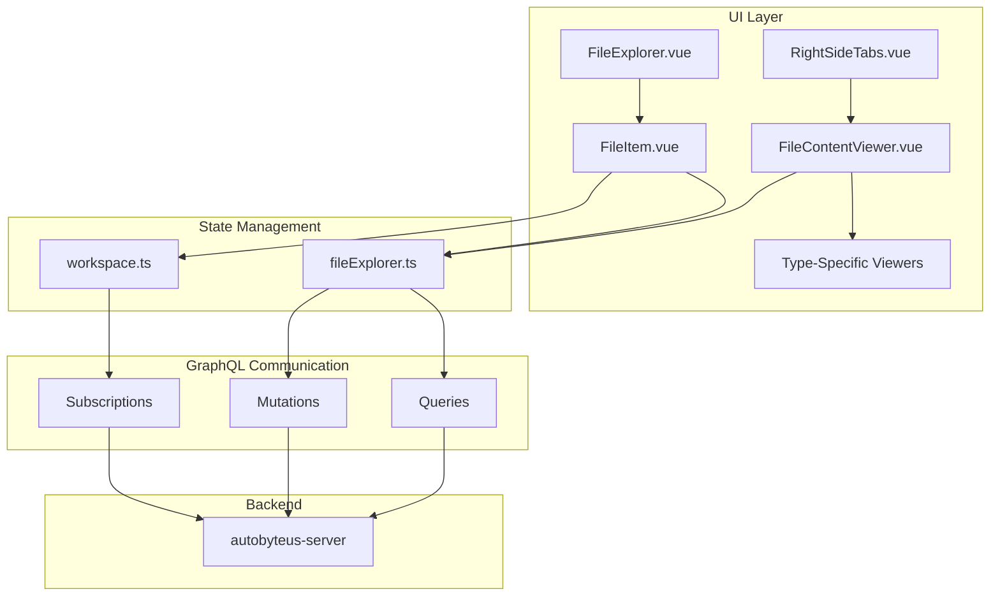
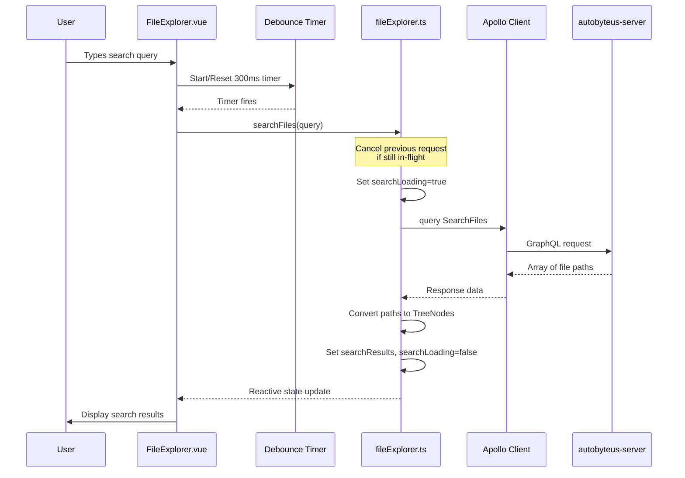
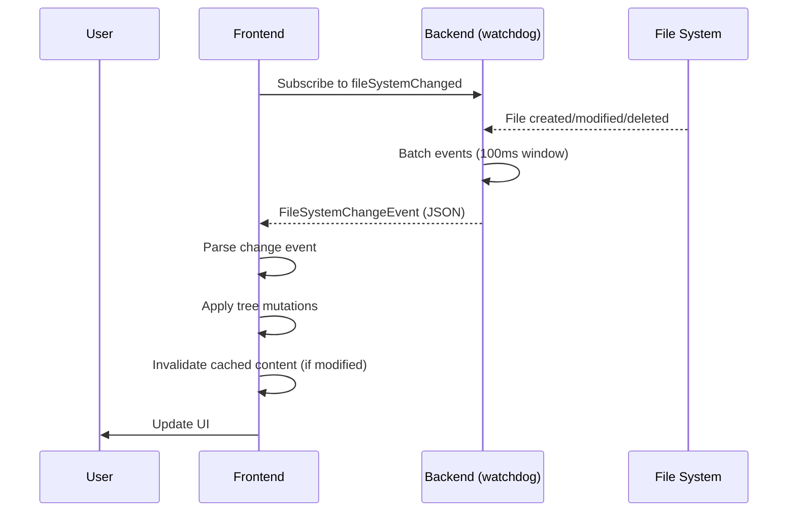

# File Explorer Module - Frontend

This document describes the design and implementation of the **File Explorer** module in the autobyteus-web frontend, which provides workspace file browsing, file content viewing, and real-time synchronization with the backend.

## Overview

The File Explorer module enables users to:

- Browse workspace directory trees with expandable folders
- View file contents with type-specific viewers (code, images, audio, video, markdown, Excel)
- Perform file operations (create, rename, delete, move via drag-and-drop)
- Search files within workspaces
- Receive real-time updates when files change on the backend
- **Lazy Load** large directories for performance

## Module Structure

```
autobyteus-web/
├── components/fileExplorer/
│   ├── FileExplorer.vue              # Main file explorer panel
│   ├── FileItem.vue                  # File/folder item with actions
│   ├── FileContentViewer.vue         # Multi-tab content viewer
│   ├── FileContextMenu.vue           # Right-click context menu
│   ├── AddFileOrFolderDialog.vue     # Create file/folder dialog
│   ├── ConfirmDeleteDialog.vue       # Delete confirmation dialog
│   ├── ConfirmDeleteDialog.vue       # Delete confirmation dialog
│   ├── MonacoEditor.vue              # Code editing component
│   └── viewers/                      # Type-specific viewers
│       ├── AudioPlayer.vue
│       ├── ExcelViewer.vue
│       ├── HtmlPreviewer.vue
│       ├── ImageViewer.vue
│       ├── MarkdownPreviewer.vue
│       └── VideoPlayer.vue
├── stores/
│   ├── workspace.ts                  # Workspace & tree state
│   ├── fileExplorer.ts               # File explorer UI state
│   └── workspaceLeftPanelLayoutStore.ts  # Layout state
├── graphql/
│   ├── queries/file_explorer_queries.ts
│   ├── mutations/file_explorer_mutations.ts
│   └── subscriptions/fileSystemSubscription.ts
├── utils/fileExplorer/
│   ├── TreeNode.ts                   # TreeNode class
│   └── fileUtils.ts                  # Tree manipulation utilities
└── types/
    └── fileSystemChangeTypes.ts      # Change event types
```

## Architecture



## Core Components

### FileExplorer.vue

Main container component for the file browser panel:

```vue
<template>
  <div class="file-explorer">
    <!-- Search input -->
    <input v-model="searchQuery" placeholder="Search files..." />

    <!-- File tree -->
    <div v-if="hasWorkspaces">
      <FileItem v-for="file in displayedFiles" :key="file.id" :file="file" />
    </div>
  </div>
</template>
```

**Key Features:**

- Search files within active workspace
- Displays workspace tree or search results
- Collapsible panel integration

### FileItem.vue

Recursive component for files and folders:

| Feature           | Description                                |
| ----------------- | ------------------------------------------ |
| **Click**         | Open file / toggle folder                  |
| **Context Menu**  | Rename, delete, add file/folder, preview   |
| **Drag & Drop**   | Move files between folders                 |
| **Visual States** | Open folder indicator, drag-over highlight |

**Drag & Drop Implementation:**

```typescript
// Set drag data with file path
onDragStart(event: DragEvent) {
  event.dataTransfer?.setData('text/plain', props.file.path)
  event.dataTransfer?.setData('source-is-file', String(props.file.is_file))
}

// Handle drop on valid folder targets
onDrop(event: DragEvent) {
  const sourcePath = event.dataTransfer?.getData('text/plain')
  const destinationPath = `${props.file.path}/${sourceFileName}`
  fileExplorerStore.moveFileOrFolder(sourcePath, destinationPath)
}
```

### FileContentViewer.vue

Multi-tab file content viewer located in the **Right Side Panel** (Files Tab).

For detailed information on supported file types and the rendering architecture (including Markdown and Mermaid support), please refer to the [Content Rendering Documentation](./content_rendering.md).

## State Management

### WorkspaceStore (workspace.ts)

Manages workspace lifecycle and tree synchronization:

```typescript
interface WorkspaceInfo {
  workspaceId: string;
  name: string;
  fileExplorer: TreeNode; // Root of directory tree
  nodeIdToNode: Record<string, TreeNode>; // Fast node lookup
  workspaceTypeName: string;
  workspaceConfig: any;
  absolutePath: string | null;
}
```

**Key Actions:**

| Action                          | Description                                                 |
| ------------------------------- | ----------------------------------------------------------- |
| `createWorkspace()`             | Creates workspace and subscribes to changes                 |
| `fetchAllWorkspaces()`          | Loads all workspaces on startup                             |
| `fetchFolderChildren()`         | **[Lazy Load]** Fetches children for a folder when expanded |
| `subscribeToWorkspaceChanges()` | Establishes WebSocket subscription                          |
| `handleFileSystemChange()`      | Applies tree mutations from server events                   |

### FileExplorerStore (fileExplorer.ts)

Manages UI state and file content:

```typescript
interface OpenFileState {
  path: string;
  type: "Text" | "Image" | "Audio" | "Video" | "Excel";
  mode: "full" | "preview";
  content: string | null;
  url: string | null;
  isLoading: boolean;
  error: string | null;
}
```

**Key Actions:**

| Action                                            | Description                  |
| ------------------------------------------------- | ---------------------------- |
| `openFile()`                                      | Opens file in full edit mode |
| `openFilePreview()`                               | Opens file in preview mode   |
| `fetchFileContent()`                              | Loads text file via GraphQL  |
| `saveFileContent()`                               | Saves content via mutation   |
| `toggleFolder()`                                  | Expands/collapses folder     |
| `searchFiles()`                                   | Searches files via GraphQL   |
| `navigateToNextTab()` / `navigateToPreviousTab()` | Tab navigation               |

## TreeNode Data Structure

Client-side representation of files/folders:

```typescript
class TreeNode {
  name: string; // File or folder name
  path: string; // Full relative path
  is_file: boolean; // True for files, false for folders
  children: TreeNode[]; // Child nodes (for folders)
  id: string; // Unique identifier
  childrenLoaded: boolean; // False if children need to be fetched via lazy load

  // Sorted insertion (directories first, then alphabetically)
  addChild(node: TreeNode): void;

  // Deserialize from server JSON
  static fromObject(obj: any): TreeNode;
}
```

## File Search

The File Search feature enables users to quickly find files within a workspace by typing a search query. It uses fuzzy matching on the backend (via `rapidfuzz`) and displays results as clickable file items.

### Architecture



### State Management

Search state is maintained per-workspace within `WorkspaceFileExplorerState`:

```typescript
interface WorkspaceFileExplorerState {
  // ... other fields ...

  // State for file search
  searchResults: TreeNode[]; // Array of matching file nodes
  searchLoading: boolean; // True while request is in-flight
  searchError: string | null; // Error message if search fails
  searchAbortController: AbortController | null; // For request cancellation
}
```

**Getters (in `fileExplorer.ts`):**

| Getter             | Returns          | Description                           |
| ------------------ | ---------------- | ------------------------------------- |
| `getSearchResults` | `TreeNode[]`     | Array of matching file nodes          |
| `isSearchLoading`  | `boolean`        | True if a search request is in-flight |
| `getSearchError`   | `string \| null` | Error message if search failed        |

### Key Features

#### 1. Debounced Input (300ms)

To avoid overwhelming the backend with requests on every keystroke, the UI debounces the search input:

```typescript
// FileExplorer.vue
let searchDebounceTimer: ReturnType<typeof setTimeout> | null = null;

watch(searchQuery, (newQuery) => {
  if (searchDebounceTimer) {
    clearTimeout(searchDebounceTimer);
  }

  searchDebounceTimer = setTimeout(() => {
    fileExplorerStore.searchFiles(newQuery);
  }, 300);
});
```

#### 2. Request Cancellation (AbortController)

If a new search is triggered while a previous request is still in-flight, the previous request is cancelled to prevent stale results from overwriting newer ones:

```typescript
// fileExplorer.ts - searchFiles action
async searchFiles(query: string) {
  const wsState = this._getOrCreateCurrentWorkspaceState();

  // Cancel any previous in-flight search request
  if (wsState.searchAbortController) {
    wsState.searchAbortController.abort();
  }
  wsState.searchAbortController = new AbortController();

  // Pass signal to Apollo Client
  const { data } = await client.query({
    query: SearchFiles,
    variables: { workspaceId, query },
    context: {
      fetchOptions: {
        signal: wsState.searchAbortController.signal
      }
    }
  });
  // ...
}
```

#### 3. TreeNode Conversion

Search results from the backend are file paths. The frontend converts these to `TreeNode` objects so they can be rendered by the same `FileItem.vue` component used for the directory tree:

```typescript
wsState.searchResults = matchedPaths.map((filePath) => {
  // First try to find existing node in the tree (for proper metadata)
  const existingNode = findFileByPath(
    workspaceStore.currentWorkspaceTree?.children || [],
    filePath
  );
  if (existingNode) return existingNode;

  // If not in tree (due to lazy loading), create a simple TreeNode
  const fileName = filePath.split("/").pop() || filePath;
  return new TreeNode(
    fileName, // name
    filePath, // path
    true, // is_file
    [], // children
    `search-${filePath}`, // unique id for search results
    true // childrenLoaded
  );
});
```

### UI Component (FileExplorer.vue)

The search input and results display are integrated into the main file explorer panel:

```vue
<template>
  <div class="file-explorer">
    <!-- Search input -->
    <input v-model="searchQuery" type="text" placeholder="Search files..." />

    <!-- Results display -->
    <div v-if="searchLoading">Loading search results...</div>
    <div v-else-if="displayedFiles.length === 0 && searchQuery">
      No files match your search.
    </div>
    <div v-else>
      <FileItem v-for="file in displayedFiles" :key="file.id" :file="file" />
    </div>
  </div>
</template>

<script setup>
const displayedFiles = computed(() => {
  if (searchQuery.value) {
    return fileExplorerStore.getSearchResults; // Show search results
  } else {
    return workspaceStore.currentWorkspaceTree?.children || []; // Show tree
  }
});
</script>
```

### Usage Example

```typescript
const fileExplorerStore = useFileExplorerStore();

// Search for files
await fileExplorerStore.searchFiles("utils");

// Access results
const results = fileExplorerStore.getSearchResults;
const isLoading = fileExplorerStore.isSearchLoading;
const error = fileExplorerStore.getSearchError;
```

### Backend Integration

The frontend sends a `SearchFiles` GraphQL query which the backend handles using a fuzzy search strategy (default: `RapidfuzzSearchStrategy`). See [autobyteus-server/docs/modules/file_explorer.md](../../autobyteus-server/docs/modules/file_explorer.md) for backend implementation details including:

- Search strategy pattern (allowing different search algorithms)
- Fuzzy matching using `rapidfuzz` library
- File name index building for performance

---

## GraphQL API

### Queries

```graphql
# Get file content
query GetFileContent($workspaceId: String!, $filePath: String!) {
  fileContent(workspaceId: $workspaceId, filePath: $filePath)
}

# Search files
query SearchFiles($workspaceId: String!, $query: String!) {
  searchFiles(workspaceId: $workspaceId, query: $query)
}

# Get folder children (Lazy Loading)
query GetFolderChildren($workspaceId: String!, $folderPath: String!) {
  folderChildren(workspaceId: $workspaceId, folderPath: $folderPath)
}
```

### Mutations

```graphql
# Write file content
mutation WriteFileContent($workspaceId: String!, $filePath: String!, $content: String!)

# Create file or folder
mutation CreateFileOrFolder($workspaceId: String!, $path: String!, $isFile: Boolean!)

# Delete file or folder
mutation DeleteFileOrFolder($workspaceId: String!, $path: String!)

# Move file or folder
mutation MoveFileOrFolder($workspaceId: String!, $sourcePath: String!, $destinationPath: String!)

# Rename file or folder
mutation RenameFileOrFolder($workspaceId: String!, $targetPath: String!, $newName: String!)
```

### Subscriptions

```graphql
# Real-time file system changes
subscription FileSystemChanged($workspaceId: String!) {
  fileSystemChanged(workspaceId: $workspaceId)
}
```

## Real-Time Synchronization

The frontend maintains sync with the backend filesystem through GraphQL subscriptions:



### Change Event Types

```typescript
interface FileSystemChangeEvent {
  changes: Array<
    AddChange | DeleteChange | RenameChange | MoveChange | ModifyChange
  >;
}

interface AddChange {
  type: "add";
  parent_id: string;
  node: { id: string; name: string; path: string; is_file: boolean };
}

interface DeleteChange {
  type: "delete";
  parent_id: string;
  node_id: string;
}

interface RenameChange {
  type: "rename";
  parent_id: string;
  node: { id: string; name: string; path: string };
}

interface MoveChange {
  type: "move";
  old_parent_id: string;
  new_parent_id: string;
  node: { id: string; name: string; path: string };
}

interface ModifyChange {
  type: "modify";
  node_id: string;
}
```

### Echo Prevention

When saving a file, the frontend marks it to ignore the next modify event (which is an echo of its own save):

```typescript
// Before saving
wsFileExplorerState.filesToIgnoreNextModify.add(filePath);

// When receiving modify event
if (wsFileExplorerState.filesToIgnoreNextModify.has(node.path)) {
  wsFileExplorerState.filesToIgnoreNextModify.delete(node.path);
  // Skip invalidation - this is our own echo
} else {
  fileExplorerStore.invalidateFileContent(node.path);
}
```

## File Utilities

### Tree Manipulation (fileUtils.ts)

| Function                         | Description                                    |
| -------------------------------- | ---------------------------------------------- |
| `handleFileSystemChange()`       | Routes change events to handlers               |
| `handleAddChange()`              | Adds node to parent with sorted insertion      |
| `handleDeleteChange()`           | Removes node from parent                       |
| `handleRenameChange()`           | Renames node and updates descendants           |
| `handleMoveChange()`             | Moves node between parents                     |
| `updateDescendantPaths()`        | Recursively updates child paths on rename/move |
| `findFileByPath()`               | Searches tree for node by path                 |
| `createNodeIdToNodeDictionary()` | Builds id→node lookup map                      |

### File Type Detection

```typescript
function determineFileType(
  filePath: string
): "Text" | "Image" | "Audio" | "Video" | "Excel" {
  const imageExtensions = [".jpg", ".jpeg", ".png", ".gif", ".bmp", ".webp"];
  const audioExtensions = [".mp3", ".wav", ".m4a", ".flac", ".ogg", ".aac"];
  const videoExtensions = [".mp4", ".mov", ".avi", ".mkv", ".webm"];
  const excelExtensions = [".xlsx", ".xls", ".xlsm", ".csv"];
  // ... extension matching logic
}
```

## Usage Examples

### Opening a File

```typescript
const fileExplorerStore = useFileExplorerStore();

// Open in full edit mode
fileExplorerStore.openFile("/src/main.ts");

// Open in preview mode
fileExplorerStore.openFilePreview("/docs/README.md");
```

### Performing File Operations

```typescript
// Create a new file
await fileExplorerStore.createFileOrFolder("/src/utils/helpers.ts", true);

// Rename a file
await fileExplorerStore.renameFileOrFolder("/src/old-name.ts", "new-name.ts");

// Delete a file
await fileExplorerStore.deleteFileOrFolder("/src/deprecated.ts");

// Move a file
await fileExplorerStore.moveFileOrFolder("/src/utils.ts", "/src/lib/utils.ts");
```

### Navigating Open Files

```typescript
// Navigate between tabs with keyboard
fileExplorerStore.navigateToNextTab(); // Arrow Right
fileExplorerStore.navigateToPreviousTab(); // Arrow Left

// Close files
fileExplorerStore.closeFile("/src/main.ts");
fileExplorerStore.closeAllFiles();
fileExplorerStore.closeOtherFiles("/src/app.ts"); // Keep only app.ts
```

## Related Modules

- **Backend**: See [autobyteus-server/docs/modules/file_explorer.md](../../autobyteus-server/docs/modules/file_explorer.md) for backend implementation
- **Workspaces**: See [autobyteus-server/docs/modules/workspaces.md](../../autobyteus-server/docs/modules/workspaces.md) for workspace concepts
- **Components**: `/components/workspace/` - Workspace configuration and views
