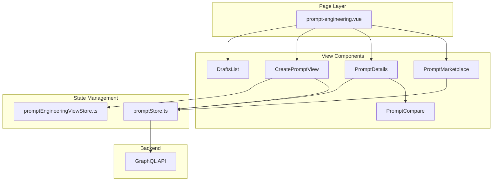
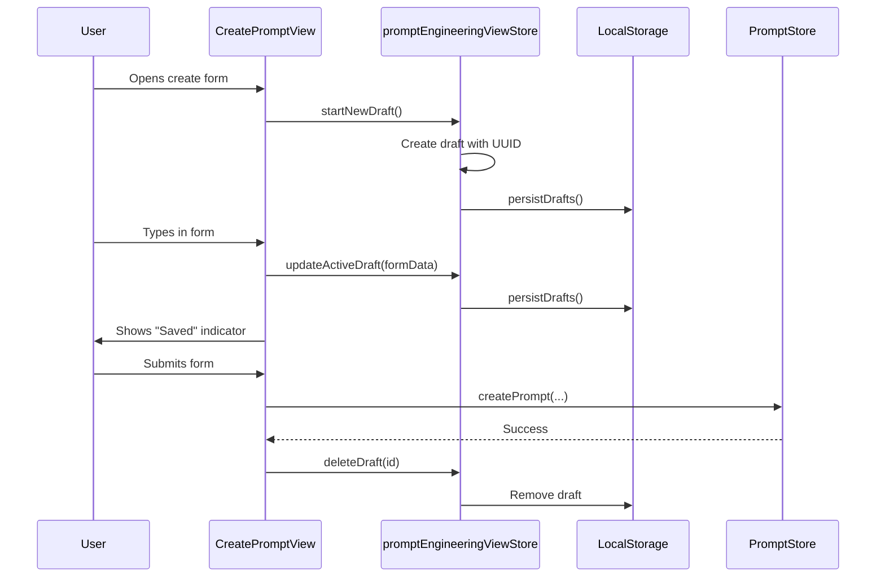

# Prompt Engineering Module - Frontend

This document describes the design and implementation of the **Prompt Engineering** module in the autobyteus-web frontend, which provides prompt creation, management, versioning, and comparison capabilities.

## Overview

The Prompt Engineering module enables users to:

- Browse and search prompts in a marketplace view
- Create new prompts with drafts support (auto-save to localStorage)
- Edit and update existing prompts with metadata
- Compare different versions of prompts side-by-side
- Sync prompts with the backend repository
- Mark prompts as active/inactive
- Delete prompts

## Navigation

Prompt Engineering is a **standalone top-level module** accessible via the main sidebar (lightbulb icon).

**Route:** `/prompt-engineering`

**Sidebar Menu Items:**

- **Prompts Marketplace** - Browse all prompts
- **My Drafts** - Manage local draft prompts

> **Note:** Skills management is a separate module with its own page (`/skills`). See [skills.md](skills.md) for details.

## Module Structure

```
autobyteus-web/
├── pages/
│   └── prompt-engineering.vue          # Main page with view routing
├── components/promptEngineering/
│   ├── PromptMarketplace.vue           # Prompts listing with filters
│   ├── PromptDetails.vue               # Full prompt view/edit
│   ├── PromptCompare.vue               # Side-by-side diff comparison
│   ├── PromptCard.vue                  # Individual prompt card
│   ├── PromptSidebar.vue               # Navigation sidebar
│   ├── CreatePromptView.vue            # Create/edit draft form
│   ├── DraftsList.vue                  # Local drafts listing
│   ├── CreatableCategorySelect.vue     # Category dropdown with create
│   ├── CanonicalModelSelector.vue      # Multi-select model picker
│   └── ModelBadge.vue                  # Model tag display
├── stores/
│   ├── promptStore.ts                  # Prompt CRUD & sync operations
│   └── promptEngineeringViewStore.ts   # View navigation & drafts
└── graphql/
    ├── queries/prompt_queries.ts       # GET_PROMPTS, GET_PROMPT_BY_ID
    └── mutations/prompt_mutations.ts   # CREATE, UPDATE, DELETE, SYNC
```

## Architecture



## View Modes

The module uses a state-driven view system managed by `promptEngineeringViewStore`:

| View Mode     | Component         | Description                           |
| ------------- | ----------------- | ------------------------------------- |
| `marketplace` | PromptMarketplace | Browse all prompts with search/filter |
| `create`      | CreatePromptView  | Create new prompt (with draft)        |
| `details`     | PromptDetails     | View/edit single prompt               |
| `drafts`      | DraftsList        | Manage local drafts                   |

## State Management

### PromptStore (promptStore.ts)

Manages prompt data and backend communication:

```typescript
interface Prompt {
  id: string;
  name: string;
  category: string;
  promptContent: string;
  description?: string;
  suitableForModels?: string;
  version: number;
  createdAt: string;
  updatedAt: string;
  parentPromptId?: string; // For versioning
  isActive: boolean;
  isForAgentTeam: boolean;
}
```

**Key Actions:**

| Action                              | Description                                             |
| ----------------------------------- | ------------------------------------------------------- |
| `fetchPrompts(isActive?)`           | Load all prompts (optionally filtered by active status) |
| `fetchPromptById(id)`               | Load single prompt details                              |
| `createPrompt(...)`                 | Create new prompt                                       |
| `updatePrompt(...)`                 | Update prompt metadata/content                          |
| `addNewPromptRevision(id, content)` | Create new version of existing prompt                   |
| `setActivePrompt(id)`               | Mark a prompt version as active                         |
| `deletePrompt(id)`                  | Delete a prompt                                         |
| `syncPrompts()`                     | Sync prompts with backend repository                    |

### PromptEngineeringViewStore (promptEngineeringViewStore.ts)

Manages UI state and local drafts:

```typescript
interface PromptEngineeringViewState {
  currentView: "marketplace" | "create" | "details" | "drafts";
  selectedPromptId: string | null;
  sidebarContext: "marketplace" | "drafts";

  // Marketplace filters
  marketplaceSearchQuery: string;
  marketplaceCategoryFilter: string;
  marketplaceNameFilter: string;
  marketplaceViewMode: "grid" | "compact";

  // Local drafts (stored in localStorage)
  drafts: PromptDraft[];
  activeDraftId: string | null;
}
```

**Key Actions:**

| Action                       | Description                          |
| ---------------------------- | ------------------------------------ |
| `showMarketplace()`          | Navigate to marketplace view         |
| `showPromptDetails(id)`      | Navigate to prompt details           |
| `showCreatePromptView()`     | Start new draft and show create form |
| `showDraftsList()`           | Show local drafts list               |
| `startNewDraft()`            | Create empty draft                   |
| `duplicateDraft(prompt)`     | Clone existing prompt as draft       |
| `updateActiveDraft(updates)` | Auto-save draft changes              |
| `deleteDraft(id)`            | Remove local draft                   |

## Core Components

### PromptMarketplace.vue

Main listing view with filtering and search:

**Features:**

- Full-text search across name, category, and content
- Category and name dropdown filters
- Grid/compact view toggle
- Sync prompts from backend
- Enter comparison mode for selected prompts

### PromptDetails.vue

Full-screen view for individual prompt:

**Features:**

- View prompt content and metadata
- Edit mode with inline editing
- Duplicate to draft
- Copy content to clipboard
- Delete prompt
- Set as active version
- Compare with other versions

### PromptCompare.vue

Side-by-side diff comparison:

**Features:**

- Side-by-side view mode
- Line-by-line diff view
- Dropdown selectors to switch compared versions
- Syntax highlighting for additions/removals
- Uses `diff-match-patch` library for diff computation

### CreatePromptView.vue

Draft-based prompt creation:

**Features:**

- Form fields: name, category, description, models, content
- Auto-save to localStorage via drafts system
- Category autocomplete with create option
- Multi-select model picker
- Form validation before submission

## GraphQL API

### Queries

```graphql
# Get all prompts
query GetPrompts($isActive: Boolean) {
  prompts(isActive: $isActive) {
    id, name, category, promptContent, description,
    suitableForModels, version, createdAt, updatedAt,
    parentPromptId, isActive, isForAgentTeam
  }
}

# Get single prompt
query GetPromptById($id: String!) {
  promptDetails(id: $id) { ... }
}

# Get prompt by name and category
query GetPromptDetailsByNameAndCategory($category: String!, $name: String!) {
  promptDetailsByNameAndCategory(category: $category, name: $name) { ... }
}
```

### Mutations

```graphql
# Create new prompt
mutation CreatePrompt($input: CreatePromptInput!) {
  createPrompt(input: $input) { ... }
}

# Update existing prompt
mutation UpdatePrompt($input: UpdatePromptInput!) {
  updatePrompt(input: $input) { ... }
}

# Create new version of prompt
mutation AddNewPromptRevision($input: AddNewPromptRevisionInput!) {
  addNewPromptRevision(input: $input) { ... }
}

# Mark prompt as active
mutation MarkActivePrompt($input: MarkActivePromptInput!) {
  markActivePrompt(input: $input) { ... }
}

# Sync prompts from backend repository
mutation SyncPrompts {
  syncPrompts { success, message, syncedCount }
}

# Delete prompt
mutation DeletePrompt($input: DeletePromptInput!) {
  deletePrompt(input: $input) { success, message }
}
```

## Drafts System

Drafts provide auto-save functionality using localStorage:



## User Flows

### Create New Prompt

1. User clicks "Create Prompt" in marketplace
2. New draft is created in localStorage
3. User fills form (auto-saved on each change)
4. User clicks "Create Prompt"
5. Prompt is saved to backend
6. Draft is deleted
7. User is redirected to prompt details

### Compare Prompt Versions

1. User views a prompt in details
2. User clicks "Compare"
3. PromptCompare component loads
4. User selects two versions from dropdowns
5. Diff is computed using diff-match-patch
6. Additions (green) and removals (red) are highlighted

### Sync Prompts

1. User clicks "Sync Prompts" in marketplace
2. `syncPrompts` mutation is called
3. Backend scans repository for prompt files
4. New/updated prompts are imported
5. Sync result shows count of changes

## Related Modules

- **Backend**: See autobyteus-server documentation for prompt storage and sync implementation
- **Agents**: Prompts can be associated with agents via `isForAgentTeam` flag
