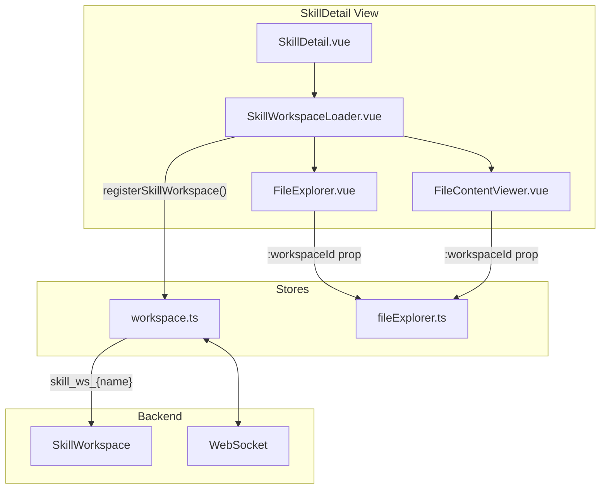

# Skills Management - Frontend

This document describes the design and implementation of the **Skills Management** module in the autobyteus-web frontend.

## Overview

The Skills module allows users to:

- View available skills (file-based capabilities).
- View the content of skill files (scripts, docs) using the **generic File Explorer**.
- Create new skills.
- Edit skill files directly in the browser with **Monaco Editor**.
- Assign skills to agents during agent creation.

## Module Structure

```
autobyteus-web/
├── pages/
│   └── skills.vue                      # Main skills management page
├── components/skills/
│   ├── SkillsList.vue                  # Skills listing with cards
│   ├── SkillCard.vue                   # Individual skill card
│   ├── SkillDetail.vue                 # Skill explorer & file viewer
│   ├── SkillWorkspaceLoader.vue        # [NEW] Transient workspace lifecycle manager
│   ├── SkillVersioningPanel.vue        # Versioning actions & status
│   └── SkillVersionCompareModal.vue    # Per-file version diff viewer
├── stores/
│   ├── skillStore.ts                   # Skills CRUD operations
│   └── workspace.ts                    # Workspace registration (incl. skill workspaces)
└── graphql/
    ├── queries/skillQueries.ts
    └── mutations/skillMutations.ts
```

## Navigation

Skills is a **standalone top-level module** accessible via the main sidebar (wrench/screwdriver icon). It is independent from the Prompt Engineering module.

**Route:** `/skills`

## View Modes

The skills page uses component-based navigation (not URL query parameters):

| View             | Component   | Description                    |
| ---------------- | ----------- | ------------------------------ |
| `list` (default) | SkillsList  | Browse available skills        |
| `detail`         | SkillDetail | View/edit files within a skill |

## Architecture: Skill Workspaces

Skills integrate with the **workspace-agnostic File Explorer** architecture. When viewing a skill's files, a **transient SkillWorkspace** is created on-demand.



### SkillWorkspaceLoader.vue

A lifecycle component that manages transient skill workspaces:

```vue
<SkillWorkspaceLoader :skillId="skill.name">
    <template #default="{ workspaceId }">
        <FileExplorer :workspaceId="workspaceId" />
        <FileContentViewer :workspaceId="workspaceId" />
    </template>
</SkillWorkspaceLoader>
```

**Lifecycle:**

1. `onMounted`: Calls `workspaceStore.registerSkillWorkspace(skillId)` → returns `skill_ws_{skillId}`
2. Provides `workspaceId` to child components via scoped slot
3. `onBeforeUnmount`: Calls `workspaceStore.unregisterSkillWorkspace(workspaceId)` → cleans up

### Workspace ID Convention

Skill workspaces use the prefix `skill_ws_` followed by the skill name:

```typescript
const workspaceId = `skill_ws_${skillId}`; // e.g., "skill_ws_brand-guidelines"
```

This prefix allows the backend `WorkspaceManager.get_or_create_workspace()` to dynamically create `SkillWorkspace` instances on first connection.

## Data Models

### Skill

```typescript
interface Skill {
  name: string;
  description: string;
  content: string; // Content of SKILL.md
  rootPath: string;
  fileCount: number;
  createdAt: string;
  updatedAt: string;
  isVersioned: boolean;
  activeVersion?: string | null;
}
```

## State Management

### skillStore.ts

Manages skill metadata (NOT file operations - those are delegated to the FileExplorer):

| Action                 | Description                              |
| :--------------------- | :--------------------------------------- |
| `fetchAllSkills()`     | Load all skills from the server.         |
| `fetchSkill(name)`     | Load a specific skill by name.           |
| `createSkill(payload)` | Create a new skill directory + SKILL.md. |
| `deleteSkill(name)`    | Delete the entire skill directory.       |
| `fetchSkillVersions(name)` | Load skill versions for versioned skills. |
| `fetchSkillVersionDiff(name, from, to)` | Fetch unified diff between two versions. |
| `enableSkillVersioning(name)` | Initialize git versioning for a skill. |
| `activateSkillVersion(name, version)` | Activate a specific skill version. |

> **Note:** File operations (view, edit, save) are now handled by the generic `FileExplorerStore` via the skill's transient workspace.

### workspace.ts (Skill Registration)

| Action                            | Description                                  |
| :-------------------------------- | :------------------------------------------- |
| `registerSkillWorkspace(skillId)` | Creates transient workspace, returns ID.     |
| `unregisterSkillWorkspace(wsId)`  | Cleans up workspace and file explorer state. |

## Agent Integration

### Agent Creation Form

The `AgentDefinitionForm.vue` component includes a "Skills Configuration" section.
It calls `skillStore.fetchAllSkills()` to populate the available skills.

- **Component**: `GroupableTagInput`
- **Data Field**: `skillNames` (List of strings)

When an agent is created, the selected `skillNames` are sent to the backend `AgentDefinition`.

## Skill Versioning (Frontend)

The Skill Detail view exposes versioning controls when the backend reports `isVersioned`:

- **Enable Versioning**: Creates the initial tag (e.g., `0.1.0`) for existing skills.
- **Activate Version**: Switches the checked-out version.
- **Compare Versions**: Opens a modal with a per-file diff viewer (no summary counts).

The compare modal uses `skillVersionDiff` to fetch a unified diff, parses it into file sections, and renders a focused diff view for the selected file.

## Related Documentation

- **[Agent Management](./agent_management.md)**: Skills are attached to agents to provide capabilities.
- **[File Explorer](./file_explorer.md)**: Skills use the generic, workspace-agnostic File Explorer.
