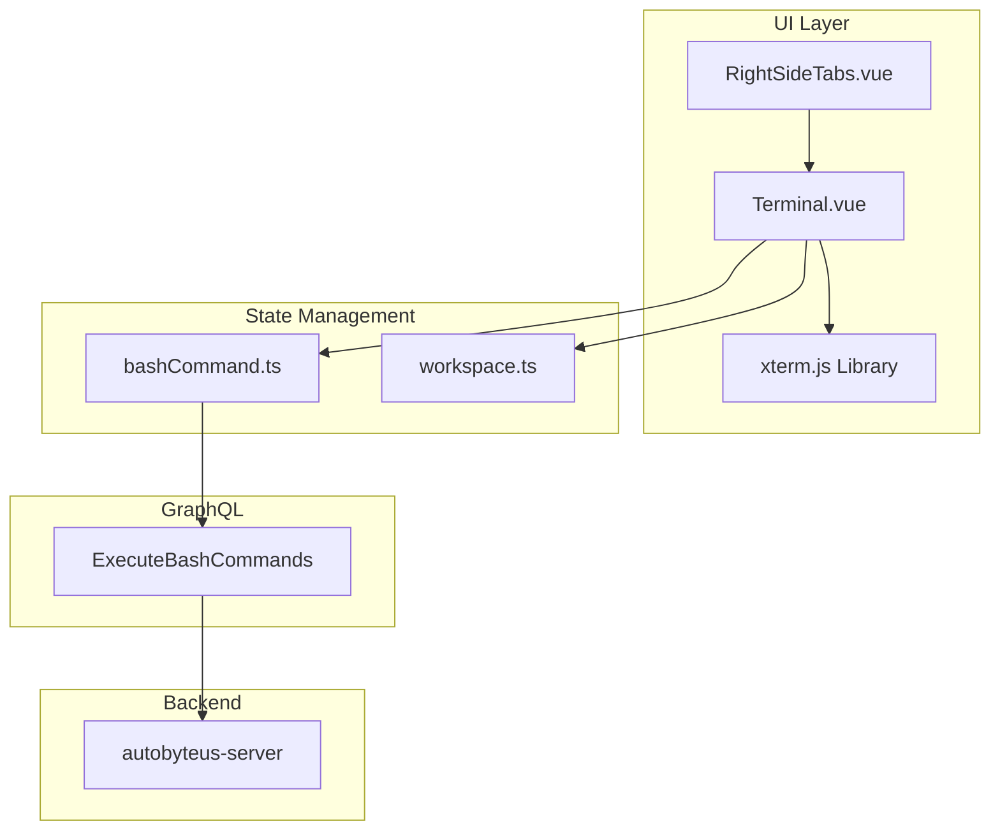
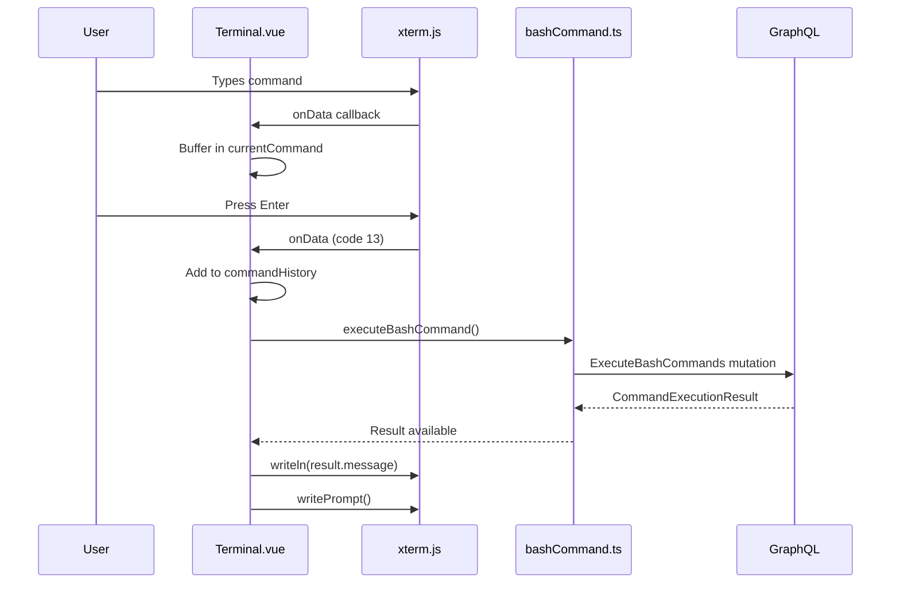

# Terminal Module - Frontend

This document describes the design and implementation of the **Terminal** module in the autobyteus-web frontend, which provides an interactive command-line interface for executing bash commands within workspace context.

## Overview

The Terminal module enables users to:

- Execute bash commands in the active workspace directory
- View command output with syntax-highlighted results
- Navigate command history with arrow keys
- Use keyboard shortcuts (Ctrl+C for interrupt)

## Module Structure

```
autobyteus-web/
├── components/workspace/tools/
│   └── Terminal.vue              # xterm.js terminal component
├── components/layout/
│   ├── RightSideTabs.vue         # Tab container with Terminal tab
│   └── RightSidebarStrip.vue     # Collapsed sidebar with Terminal icon
├── composables/
│   └── useRightSideTabs.ts       # Tab state management
├── stores/
│   └── bashCommand.ts            # Command execution Pinia store
└── graphql/mutations/
    └── workspace_mutations.ts    # ExecuteBashCommands mutation
```

## Architecture



## Core Components

### Terminal.vue

Main terminal component using xterm.js for rich terminal emulation.

**Libraries Used:**

| Library              | Version | Purpose                           |
| -------------------- | ------- | --------------------------------- |
| `@xterm/xterm`       | ^5.5.0  | Terminal emulator core            |
| `@xterm/addon-fit`   | ^0.10.0 | Auto-resize terminal to container |
| `@xterm/addon-webgl` | ^0.19.0 | GPU-accelerated rendering         |

**Key Features:**

- **Workspace-aware prompt**: Displays active workspace name in colored prompt
- **Command history**: Navigate with Up/Down arrow keys
- **Input handling**: Backspace, Enter, character input
- **Ctrl+C support**: Interrupt current input
- **Responsive sizing**: Auto-fits container with ResizeObserver

**Terminal Configuration (Light Theme):**

```typescript
terminalInstance.value = new Terminal({
  cursorBlink: true,
  cursorStyle: "bar",
  fontFamily: 'Menlo, Monaco, "Courier New", monospace',
  fontSize: 13,
  theme: {
    background: "#ffffff",
    foreground: "#383a42",
    cursor: "#528bff",
    green: "#50a14f", // Workspace name
    blue: "#4078f2", // Prompt path
  },
  scrollback: 5000,
});
```

**Input Handling Flow:**



### bashCommand.ts (Pinia Store)

Manages command execution state and API communication.

**State:**

```typescript
interface BashCommandState {
  // Results keyed by unique command identifier
  commandResults: Record<string, BashCommandResult>;
  // Tracks in-progress commands to prevent duplicates
  commandsInProgress: Set<string>;
}

interface BashCommandResult {
  success: boolean;
  message: string;
}
```

**Actions:**

| Action               | Parameters                       | Description                 |
| -------------------- | -------------------------------- | --------------------------- |
| `executeBashCommand` | workspaceId, command, commandKey | Execute command via GraphQL |

**Getters:**

| Getter                     | Returns             | Description                   |
| -------------------------- | ------------------- | ----------------------------- |
| `isApplyCommandInProgress` | `boolean`           | True if command is executing  |
| `isCommandExecuted`        | `boolean`           | True if command has completed |
| `getApplyCommandResult`    | `BashCommandResult` | Get result for command key    |
| `getApplyCommandError`     | `string \| null`    | Get error message if failed   |

### RightSideTabs.vue

Tab container that hosts the Terminal alongside other workspace tools.

**Available Tabs:**

| Tab Name      | Label      | Visibility | Component          |
| ------------- | ---------- | ---------- | ------------------ |
| `files`       | Files      | Always     | FileExplorerLayout |
| `teamMembers` | Team       | Team mode  | TeamOverviewPanel  |
| `todoList`    | To-Do      | Agent mode | TodoListPanel      |
| `terminal`    | Terminal   | Always     | Terminal           |
| `vnc`         | VNC Viewer | Always     | VncViewer          |

## GraphQL API

### Mutation

```graphql
mutation ExecuteBashCommands($workspaceId: String!, $command: String!) {
  executeBashCommands(workspaceId: $workspaceId, command: $command) {
    __typename
    success
    message
  }
}
```

### Response Type

```typescript
interface CommandExecutionResult {
  success: boolean; // True if exit code was 0
  message: string; // stdout/stderr output
}
```

## Styling

The Terminal uses a light theme matching the application design:

- **Background**: White (`#ffffff`)
- **Text**: Dark gray (`#383a42`)
- **Cursor**: Blue (`#528bff`)
- **Prompt Workspace**: Bright green (`#50a14f`)
- **Prompt Path**: Bright blue (`#4078f2`)
- **Scrollbar**: Gray-300 with Gray-400 hover

**Custom CSS:**

```css
.terminal-container {
  background-color: #ffffff;
  cursor: text;
  padding: 0;
}

.xterm {
  padding: 12px 0 0 12px; /* Internal padding for text */
}
```

## Usage Example

The Terminal is automatically available when a workspace is active:

1. Open a workspace
2. Click the "Terminal" tab in the right panel (or the Terminal icon in the collapsed sidebar)
3. Type commands and press Enter
4. View output directly in the terminal

**Prompt Format:**

```
workspace-name:~$ <your-command>
```

## Related Documentation

- **Backend**: See [terminal.md](../../autobyteus-server/docs/modules/terminal.md) for backend implementation
- **Workspaces**: See workspaces documentation for workspace context
