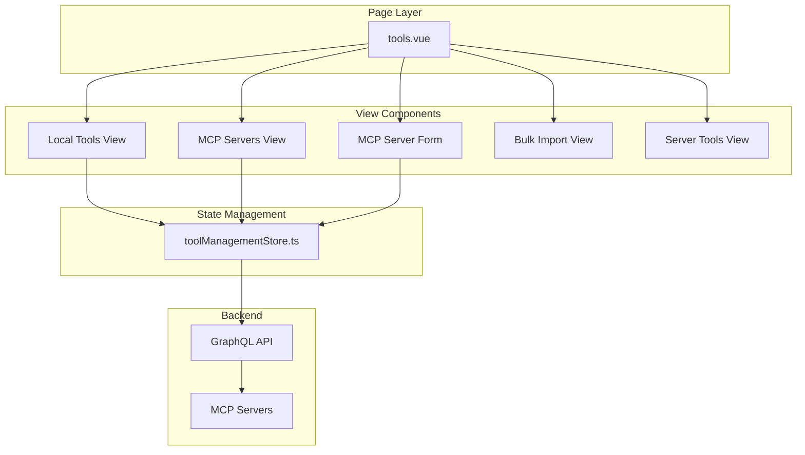
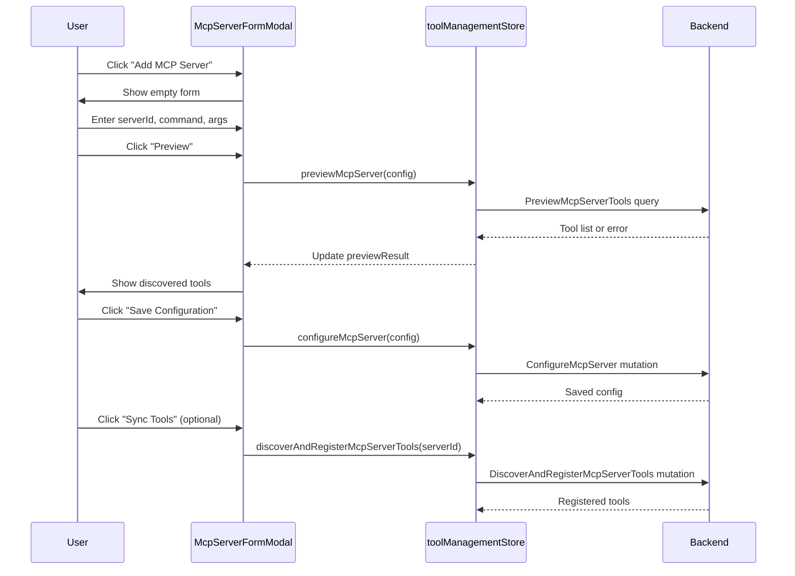

# Tools and MCP Module - Frontend

This document describes the design and implementation of the **Tools and MCP** module in the autobyteus-web frontend, which provides tool browsing, MCP server management, and tool discovery capabilities.

## Overview

The Tools and MCP module enables users to:

- Browse local tools with category grouping and search
- Add and configure MCP (Model Context Protocol) servers
- Discover and register tools from MCP servers
- Preview MCP server connections before saving
- Bulk import MCP server configurations from JSON
- View tool parameters and schemas
- Reload tool schemas after changes

## Module Structure

```
autobyteus-web/
├── pages/
│   └── tools.vue                       # Main tools page with view routing
├── components/tools/
│   ├── ToolsSidebar.vue                # Navigation sidebar
│   ├── ToolsFilter.vue                 # Search and category filter
│   ├── ToolList.vue                    # Tool listing by category
│   ├── ToolCard.vue                    # Individual tool display
│   ├── ToolDetailsModal.vue            # Tool schema modal
│   ├── ToolsConfirmationModal.vue      # Delete confirmation dialog
│   ├── McpServerList.vue               # MCP servers listing
│   ├── McpServerCard.vue               # Individual server display
│   ├── McpServerFormModal.vue          # Add/edit MCP server form
│   └── McpBulkImportView.vue           # JSON bulk import view
├── stores/
│   └── toolManagementStore.ts          # Tools and MCP state management
└── graphql/
    ├── queries/toolQueries.ts          # Tool fetch queries
    ├── queries/mcpServerQueries.ts     # MCP server queries
    ├── mutations/toolMutations.ts      # Tool schema reload
    └── mutations/mcpServerMutations.ts # MCP server CRUD
```

## Architecture



## View Modes

The module uses a state-driven view system with the following views:

| View              | Component          | Description                        |
| ----------------- | ------------------ | ---------------------------------- |
| `local-tools`     | ToolList           | Browse local tools by category     |
| `mcp-servers`     | McpServerList      | List configured MCP servers        |
| `mcp-form`        | McpServerFormModal | Add/edit MCP server config         |
| `mcp-bulk-import` | McpBulkImportView  | Import servers from JSON           |
| `mcp-tools-{id}`  | ToolList           | View tools for specific MCP server |

## Data Models

### Tool

```typescript
interface Tool {
  name: string;
  description: string;
  origin: "LOCAL" | "MCP";
  category: string;
  argumentSchema: {
    parameters: ToolParameter[];
  } | null;
}

interface ToolParameter {
  name: string;
  paramType: string;
  description: string;
  required: boolean;
  defaultValue: string | null;
  enumValues: string[] | null;
}
```

### MCP Server

MCP servers support two transport types:

```typescript
interface McpServer {
  __typename: "StdioMcpServerConfig" | "StreamableHttpMcpServerConfig";
  serverId: string;
  transportType: "STDIO" | "STREAMABLE_HTTP";
  enabled: boolean;
  toolNamePrefix: string;

  // STDIO-specific
  command?: string;
  args?: string[];
  env?: Record<string, string>;
  cwd?: string;

  // HTTP-specific
  url?: string;
  token?: string;
  headers?: Record<string, string>;
}
```

## State Management (toolManagementStore.ts)

```typescript
interface ToolManagementState {
  localTools: Tool[];
  localToolsByCategory: ToolCategoryGroup[];
  mcpServers: McpServer[];
  toolsByServerId: Record<string, Tool[]>;
  loading: boolean;
  error: any;
  previewResult: PreviewResult | null;
}
```

**Key Actions:**

| Action                                        | Description                          |
| --------------------------------------------- | ------------------------------------ |
| `fetchLocalToolsGroupedByCategory()`          | Load local tools grouped by category |
| `fetchMcpServers()`                           | Load all configured MCP servers      |
| `fetchToolsForServer(serverId)`               | Load tools registered for a server   |
| `previewMcpServer(input)`                     | Test connection and preview tools    |
| `configureMcpServer(input)`                   | Save MCP server configuration        |
| `deleteMcpServer(serverId)`                   | Remove MCP server                    |
| `discoverAndRegisterMcpServerTools(serverId)` | Sync tools from server               |
| `importMcpServerConfigs(json)`                | Bulk import from JSON string         |
| `reloadToolSchema(toolName)`                  | Refresh tool schema from backend     |

## Core Components

### ToolList.vue

Displays tools grouped by category:

- Category headers with tool count
- Grid layout of ToolCard components
- Search filtering by name/description
- Optional back button for nested views

### McpServerFormModal.vue

Full-featured MCP server configuration:

**Features:**

- Form tab: Visual configuration fields
- JSON tab: Raw JSON input for advanced users
- Transport type toggle (STDIO / HTTP)
- STDIO config: command, args, env vars, working directory
- HTTP config: URL, token, headers
- Server preview before saving
- Tool discovery after save

**Workflow:**

1. User fills form or pastes JSON
2. User clicks "Preview" to test connection
3. Preview shows discovered tools
4. User clicks "Save Configuration"
5. Option to sync tools after save

### McpBulkImportView.vue

Import multiple MCP servers from JSON:

- Accepts JSON array of server configs
- Shows import results (success/failure counts)
- Useful for sharing configurations across environments

## GraphQL API

### Tool Queries

```graphql
# Get tools (optionally filtered by origin/server)
query GetTools($origin: ToolOriginEnum, $sourceServerId: String) {
  tools(origin: $origin, sourceServerId: $sourceServerId) {
    name, description, origin, category
    argumentSchema { parameters { name, paramType, required, ... } }
  }
}

# Get local tools grouped by category
query GetToolsGroupedByCategory($origin: ToolOriginEnum!) {
  toolsGroupedByCategory(origin: $origin) {
    categoryName
    tools { name, description, origin, category, argumentSchema { ... } }
  }
}
```

### MCP Server Queries

```graphql
# Get all configured MCP servers
query GetMcpServers {
  mcpServers {
    ... on StdioMcpServerConfig {
      serverId
      transportType
      enabled
      toolNamePrefix
      command
      args
      env
      cwd
    }
    ... on StreamableHttpMcpServerConfig {
      serverId
      transportType
      enabled
      toolNamePrefix
      url
      token
      headers
    }
  }
}

# Preview server tools before saving
query PreviewMcpServerTools($input: McpServerInput!) {
  previewMcpServerTools(input: $input) {
    name
    description
  }
}
```

### MCP Server Mutations

```graphql
# Save MCP server configuration
mutation ConfigureMcpServer($input: McpServerInput!) {
  configureMcpServer(input: $input) {
    savedConfig { serverId, transportType, ... }
  }
}

# Delete MCP server
mutation DeleteMcpServer($serverId: String!) {
  deleteMcpServer(serverId: $serverId) {
    success, message
  }
}

# Sync tools from MCP server
mutation DiscoverAndRegisterMcpServerTools($serverId: String!) {
  discoverAndRegisterMcpServerTools(serverId: $serverId) {
    success, message, discoveredTools { name, description, ... }
  }
}

# Bulk import servers from JSON
mutation ImportMcpServerConfigs($jsonString: String!) {
  importMcpServerConfigs(jsonString: $jsonString) {
    success, message, importedCount, failedCount
  }
}
```

## User Flows

### Add MCP Server (STDIO)



### Browse Local Tools

1. User navigates to Tools page
2. `fetchLocalToolsGroupedByCategory()` loads all local tools
3. Tools are displayed grouped by category
4. User can search by name/description
5. User can filter by category dropdown
6. Clicking a tool shows ToolDetailsModal with parameters

### Reload Tool Schema

1. User views a tool in ToolDetailsModal
2. User clicks "Reload Schema" button
3. `reloadToolSchema(toolName)` mutation is called
4. Updated schema is returned and displayed
5. Toast notification confirms success/failure

## MCP Transport Types

### STDIO Transport

For MCP servers that run as local processes:

| Field     | Description                                      |
| --------- | ------------------------------------------------ |
| `command` | Executable path (e.g., `npx`, `python`)          |
| `args`    | Command arguments (e.g., `["-m", "mcp_server"]`) |
| `env`     | Environment variables                            |
| `cwd`     | Working directory                                |

### Streamable HTTP Transport

For MCP servers accessed over HTTP:

| Field     | Description                   |
| --------- | ----------------------------- |
| `url`     | Server endpoint URL           |
| `token`   | Optional authentication token |
| `headers` | Optional custom headers       |

## Related Modules

- **Agents**: Agents use tools during conversations
- **Conversation**: Tool calls appear as ToolCallSegment components
- **Backend**: See autobyteus-server documentation for tool registry and MCP integration
